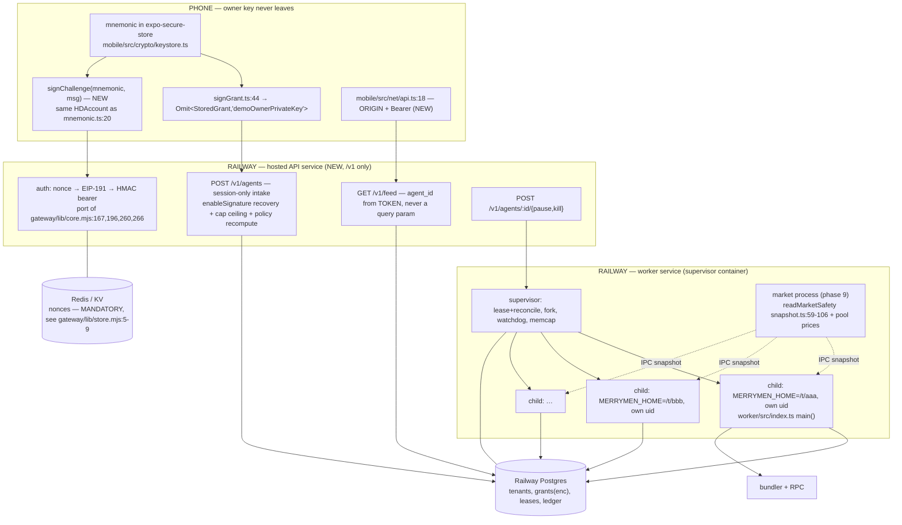

# Hosted multi-tenant merrymen worker on Railway — design (task #83)

**Status:** proposed · **Author:** design pass over `merrymen@main`, revised after adversarial review · **Audience:** maintainer

---

## 1. TL;DR

**Is it worth building?** Yes. Without it the phone app is a viewer, not an agent — and "the agent runs on your phone" is not achievable on iOS at any price. The runtime work is tractable because the isolation the design needs already exists in the codebase, expressed as a *process* boundary: `merrymenHome()` reads `MERRYMEN_HOME` at call time (`worker/src/home.ts:16`) and every path derives from it lazily (`worker/src/home.ts:19-33`).

**The single biggest catch — and it is a blocker, not a caveat: the wall does not currently confine the server.** Five exits, in descending order of how badly they end:

| # | Exit | Where | Bound today |
|---|---|---|---|
| **E0** | **ERC-1271 / off-chain signing.** `toPermissionValidator` implements `signMessage` and `signTypedData` for the session key (`node_modules/@zerodev/permissions/toPermissionValidator.ts:91-102`, returning `0xff ‖ sig`), and the kernel account routes `signMessage` straight into it (`node_modules/@zerodev/sdk/accounts/kernel/createKernelAccount.ts:730, :766`). `flag` defaults to `PolicyFlags.FOR_ALL_VALIDATION` (`toPermissionValidator.ts:37`); `toCallPolicy`'s `policyFlag` defaults the same way (`policies/toCallPolicy.ts:59`). **Grep confirms merrymen sets no policy flag anywhere** in `packages/`, `worker/src`, `web/src` or `mobile/src` — `buildWallPolicies` (`packages/core/src/wall.ts:191-211`) passes only `policyVersion` and `permissions` | `packages/core/src/wall.ts:199-208` | **none — a call policy constrains UserOp CALLS, not signatures.** Permit2 is an approved spender (`wall.ts:43-50`) and stock approvals carry no amount condition, so a Permit2 `permitTransferFrom` signed by the session key and submitted from the attacker's own EOA moves tokens to any recipient with no UserOp, no rate limit and no recipient pin. Same shape for EIP-2612 permits and any 1271-based off-chain order |
| **E1** | `swapRouter02.exactInputSingle`, **no `args` at all** — `recipient` is tuple member 4, `amountOutMinimum` member 6, `sqrtPriceLimitX96` member 7 (`packages/core/src/abis.ts:9-27`) | `packages/core/src/wall.ts:137-144` | none; stock approvals are deliberately amount-free (`wall.ts:98-107`, pinned at `worker/src/wall.test.ts:93`) |
| **E2** | Morpho `withdraw(assets, receiver, owner)`, **no `args` at all** | `packages/core/src/wall.ts:153-160` | none — `worker/src/wall.test.ts:112` asserts `wd.args === undefined` *on purpose* |
| **E3** | `USDG.transfer(any recipient, ≤ perTradeUsdg)` | `packages/core/src/wall.ts:121-130` | per-op only → 2,400 USDG/day for 14 days at the default preset (50 × 48); 19,200/day for 30 days at "warlord" (200 × 96) — `web/src/app/grant/page.tsx:30-36, :53-57` |
| **E4** | Permit2 → UniversalRouter opaque `execute`; and **`allowedSpenders()` still names Permit2 and the Rialto router**, so unbounded approvals to both survive dropping the *call* permissions | `packages/core/src/wall.ts:161-181`, `:43-50` | spender pinned; calldata unconstrainable by a call policy |

A fully compromised hosted box therefore moves **~100% of every tenant's portfolio minus the gas ETH**, today, inside the signature the owner already gave. "The server can never move funds out" is currently marketing, not a property. **Narrowing the hosted wall is step zero; nothing else ships first — and E0 is the first item inside it, ahead of argument pinning, because it survives every other fix.**

What *does* hold, no matter how bad the compromise: native ETH cannot move (`worker/src/wall.test.ts:143`, every `valueLimit` asserted `0n`); the wall cannot be widened, because `enableSignature` is EIP-712 bound to the account, chain, permission id, validator nonce and the whole policy blob (`node_modules/@zerodev/sdk/accounts/kernel/utils/plugins/ep0_7/getPluginsEnableTypedData.ts:31-70`); the session key cannot become sudo; expiry is contract-enforced (`packages/core/src/wall.ts:201`); and on the phone path the owner key is never ours to lose (`mobile/src/crypto/signGrant.ts:44`).

**Recommendation in one line:** narrow the wall (signature validation first) → fork a new minimal hosted API → process-per-tenant supervisor on Railway → hosted Postgres for the ledger → drop custom strategies on hosted → no performance fee until counsel clears it.

---

## 2. Why hosted at all

iOS suspends a backgrounded app; there is no execution model in which a JS tick loop keeps firing stop-losses while the phone is in a pocket. Background fetch is opportunistic, minutes-to-hours granularity, and the OS may skip it entirely. A trading agent whose stop-loss fires "sometimes, if the user opens the app" is not a product.

What the phone **can** do, and already does:

| Capability | Shipped at |
|---|---|
| Hold the owner key in `expo-secure-store`, never uploaded | `mobile/src/crypto/keystore.ts`, `mobile/src/crypto/signGrant.ts:29-33` |
| Build and sign the grant locally; return `Omit<StoredGrant, "demoOwnerPrivateKey">` | `mobile/src/crypto/signGrant.ts:44`, `:100-116` |
| Seed-phrase recovery, on-device, no server | `mobile/src/app/recover.tsx` |
| Sign an arbitrary EIP-191 message with the same HDAccount already used as the sudo signer | `mobile/src/crypto/mnemonic.ts:20`, used at `mobile/src/crypto/signGrant.ts:65-72` |
| Point at a real origin via one seam, with an explicit note that no auth contract exists yet | `mobile/src/net/api.ts:13-18, :34` |

What the phone **cannot** do: run the tick loop; hold a long-poll socket to Telegram; guarantee a UserOp gets submitted before the process is frozen.

So: the phone stays the key holder and the signer of intent. The server becomes a **capped, expiring executor** — and the whole design is about making that sentence literally true.

---

## 3. Goals / non-goals

### Goals

1. **The server holds only `grant.serialized`** — the capped, expiring session account, and only with signature-validation authority stripped (§5.2). Nothing else with signing power.
2. Per-tenant tick loop with real failure isolation: one tenant's crash, hang or OOM does not stop another tenant's stop-loss.
3. Phone→server auth with no accounts, no passwords, no email, no PII — the wallet is the identity.
4. **Self-hosted keeps working byte-for-byte.** Same npm package, same `~/.merrymen`, same SQLite, same custom strategies, same PC control. No new required dependency reaches an existing user.
5. Recovery stays **seed-phrase, on the phone, already shipped**. The server offers no recovery path and needs none.
6. Honest kill/pause semantics — the UI must not say "revoked" when it means "we stopped and deleted our copy".

### Non-goals (v1)

| Non-goal | Why |
|---|---|
| Custom `.mjs` strategies on hosted | Arbitrary code execution as a service in the process holding every tenant's session key — see §6 |
| Paymaster / sponsored gas | `worker/src/gas.ts:18`: "The account self-pays gas from its own ETH; there is no paymaster." Sponsoring makes us the funder with no cap at the point of spend |
| Performance-fee collection on hosted | §8; discretionary execution + asset-moving key + profit share is a counsel question, and collection has never shipped anyway (`worker/src/fees.ts:7-9`) |
| Multi-hop Uniswap routing on hosted | The hosted wall grants `exactInputSingle` only; `exactInput`'s tuple is dynamic and its `path` is unconstrainable by a call policy — see §5.2. Hosted tenants get single-hop routes, which is worse pricing on thin pairs and no route at all on some. That is a **product consequence**, stated up front, not a footnote |
| Hosting the existing Next.js dashboard | `web/src/middleware.ts:56` returns false for every public host by design. Fork a new API instead (§5.4) |
| One shared process for many tenants (R1) | Would require hoisting `let active` (`worker/src/index.ts:202`) and ~20 sibling mutables *before the first paying tenant*, including the money counters — see §4.1 |

### The Robinhood venue — scoped into the task, and it does not fit this design

The task title includes the Robinhood rail. It is not a later phase of this design; it is a different product with a different legal structure, and the doc should say so rather than defer to a memo.

Hosting it means the server holds **OAuth brokerage credentials that move real money with no on-chain wall behind them**. `worker/src/policy.ts:1-12` says it outright: on the EVM rail the policy layer is a *mirror* of an on-chain wall that wins any disagreement; **on the broker rail "there is NO on-chain policy to mirror"** — our own process is the only control that exists. And the auth flow cannot even complete headless: `worker/src/venues/robinhood-auth.ts:105` binds a 127.0.0.1 catcher with a loopback redirect URI, deliberately ("binding 0.0.0.0 would expose the catcher to the network"), and there is no browser on a Railway box.

So there is no non-custodial form of it. Holding those tokens *is* custody, which the standing invariant forbids, and no wall-narrowing exercise helps because there is no wall. Self-hosted it stays exactly as it is — the user's own machine, the user's own broker session. Hosted, it needs its own product decision (are we a broker-adjacent custodian?) before it needs an engineering design.

---

## 4. Architecture

### 4.1 Tenancy model: one OS process per tenant, one supervisor

The alternative — `Map<tenantId, ActiveAgent>` in one process — was evaluated and rejected for v1. The reason is not performance, it is that every isolation property is lost simultaneously and the failure mode is other people's money.

| Property | Process per tenant (chosen) | One process, N agents |
|---|---|---|
| Money counters `spentTodayUsdg` / `opsToday` / `highWaterMarkUsdg` (`worker/src/index.ts:315-317`, seeded per-arm at `:692-696`) | per-tenant for free | must be hoisted into `ActiveAgent` (`worker/src/index.ts:176-196`) or tenant B consumes tenant A's daily cap at `worker/src/policy.ts:294-296` and A's peak becomes B's HWM at `:302-309` |
| **Ledger reads** | **not isolated** — under the chosen architecture tenants share one Postgres (§7), so the 16 unscoped queries in `worker/src/telegram/reads.ts` are a leak in *both* topologies. Phase 2 is unconditional | same leak |
| Filesystem state — settings, grant, pause marker, heartbeat, soul, strategies dir | isolated by `MERRYMEN_HOME`, **against accidental mixing** — see the trust-boundary note below | one file each, fleet-wide blast radius |
| Fatal error | `main().catch(… process.exit(1))` (`worker/src/index.ts:1872-1875`) becomes *correct*: one child dies, supervisor restarts it | takes the fleet down |
| Hung strategy | contained to that child; SIGKILL reclaims a spinning CPU | wedges everyone (see §4.3) |
| Mainnet client singleton `let mainnet` (`worker/src/snapshot.ts:28-33`, repointed by `setMainnetRpc` at `worker/src/index.ts:211` and `:288`) | irrelevant — one per process | last tenant to save `rpcMainnet` repoints everyone's price feeds |
| Kill (`rmSync(homePaths.grant())`, `worker/src/index.ts:1821`) and pause (`worker/src/home.ts:30`, checked at `worker/src/index.ts:1660`) | work unchanged | one file, fleet-wide |
| Marginal memory | **≥93 MB RSS measured** (node v22.17.0: 37.1 MB baseline → 93.3 MB after importing `viem` + `@zerodev/sdk` + `@zerodev/permissions` + `node:sqlite`), plus tsx | one copy of the dep tree |
| Duplicated chain-global RPC | 3 round-trips/tick/tenant for `readMarketSafety` (`worker/src/snapshot.ts:59-106`) | naturally shared |

**Supervisor↔child trust boundary — say what it is and is not.** `MERRYMEN_HOME=/t/aaa` is an *argument*, not an enforcement. Children run as the same uid on a shared filesystem with the same Postgres role, so a hostile child A can read `/t/bbb/grant.json` — the one artifact §5.1 says the server holds. §6 (no user code on hosted) is what makes children trusted; the process boundary alone buys isolation against *accidents*, not against code. Phase 4 therefore adds a per-child uid (or per-tenant mount / per-tenant DB role) as defense in depth, and until it lands the claim in the docs is "isolates accidental cross-tenant state", not "isolates a hostile child".

The memory floor is real and is the binding constraint: a 4 GB container carries **tens** of tenants, not thousands. Buy headroom in this order, none of which requires the in-process refactor: (a) compile the worker so tsx is not in the hot image (`cli/bin.mjs:551` launches it as `tsx worker/src/index.ts`); (b) split out a shared market-data process (§4.4); (c) only then consider sharded multi-agent processes.

### 4.2 Diagram



### 4.3 The tick loop with N agents

Each child runs today's loop unmodified: `tick().catch().finally(() => setTimeout(runLoop, cfg.tickSeconds * 1000))` (`worker/src/index.ts:1864-1869`). The supervisor adds what the loop cannot do for itself.

| Concern | Mechanism | Grounding |
|---|---|---|
| **Hang** | Wall-clock timeout around `await strategy.tick(snap)` **plus** supervisor SIGKILL. Both are needed — a JS timeout cannot reclaim a spinning CPU | `worker/src/index.ts:1677`; `worker/src/strategies/custom.ts:187` catches *throws* only, so `await new Promise(() => {})` means the tick promise never settles, `.finally` never fires, and the loop stops forever with a silently stale heartbeat |
| **Liveness — and its collision with a slow bundler** | `heartbeat()` (`worker/src/index.ts:1285`) is written **once per tick, early** — called at `:1304`, *before* `processIntent` and its inline receipt wait. So a naive "no advance in ~3 tick intervals" watchdog is 45 s at today's 15 s floor and **would SIGKILL healthy tenants mid-UserOp**. Two required changes: derive the threshold from `bundlerTimeout + 2 × tickSeconds`, not from tick count; and emit a **second beat around the receipt wait** (or move the heartbeat off the tick path entirely) so "waiting on a mine" is distinguishable from "wedged" | `worker/src/index.ts:1290` writes `homePaths.heartbeat()` (`worker/src/home.ts:22`) |
| **Double-arming** | Per-tenant exclusive lease (Postgres advisory lock), taken *before* `syncGrant` arms, renewed each tick, refuse to arm without it | none exists today: `worker/src/index.ts:597` arms whatever grant it finds with no lock, and `worker/src/store.ts:20` sets WAL and *no* `busy_timeout`, so contended writes fail immediately and are then swallowed by `console.error` |
| **In-flight UserOp after a kill/restart** | **New, and load-bearing.** A lease stops two *armed* children; it does nothing about an op a killed or lease-losing child already submitted. Because arming re-seeds the spend counters from the DB (`worker/src/index.ts:692-696`), a restart after a SIGKILL between `sendUserOperation` and `addTrade` under-counts spend and re-proposes against a cap that does not know about the op in flight. **Lease acquisition and reconciliation are one step:** take the lease → scan the chain/bundler for ops from this session key since the last recorded trade id → write the missing rows → *then* seed counters and arm | `worker/src/executor.ts:62-65` (inline receipt wait), `worker/src/store.ts:564` (`getSpentTodayUsdg` reads the ledger back) |
| **Slow bundler** | Confined by construction: `executor.execute` awaits `waitForUserOperationReceipt` inline (`worker/src/executor.ts:62-65`) inside `processIntent` inside `tick()`, and the `.finally` reschedule starts counting only afterwards — so a 40 s mine stretches *that tenant's* cadence and nobody else's | `worker/src/index.ts:1867` |
| **Crash** | `process.exit(1)` (`worker/src/index.ts:1874`) stays as-is; supervisor restarts one child | — |
| **Memory** | Per-child `--max-old-space-size` below container-limit/N with headroom; an OOM kill on a shared container takes the container, not the offender | — |
| **Env inheritance** | Fork with a **scrubbed** env and inject per-tenant secrets explicitly | `worker/src/settings.ts` falls back to `process.env` for `bundlerApiKey` (`:210`), `groqApiKey` (`:214`), `anthropicApiKey` (`:216`), `telegramBotToken` (`:257`) — on Railway that env is the *platform's*, so every tenant would silently inherit our keys as their default |
| **Fleet halt** | New operator-only flag checked in the arming path — does not exist at any granularity today | — |

### 4.4 Seams the design leans on

| Seam | File:line | Role |
|---|---|---|
| `merrymenHome()` reads env at **call** time; `ensured` latch makes it a *process* boundary | `worker/src/home.ts:16`, `:35` | the whole per-tenant fork |
| `loadGrantFile()` — one 10-line function already parameterized by `MERRYMEN_GRANT_FILE` | `worker/src/grant.ts:6-15` | hosted grant intake |
| `resolveConfig()` is the only thing turning a path into a `ResolvedConfig`; every loop already takes an injected `getCfg` closure | `worker/src/settings.ts:281-291`; `worker/src/index.ts:1802, 1832, 1852` | per-tenant config with no signature churn |
| `createAgentExecutor({chain, serializedGrant, bundlerUrl, rpcUrl})` needs **only** `serialized` — no owner key field exists in its input | `worker/src/executor.ts:33-39` | proof the invariant is reachable |
| `readMarketSafety()` returns a plain value object of chain-global data | `worker/src/snapshot.ts:59-106` | hoist to one fleet-wide read |
| `makeCustomStrategy(name, { importer })` — the one door to user code, already injectable | `worker/src/strategies/custom.ts:136` | the RCE fork point |
| `getDb()` singleton | `worker/src/store.ts:15-19` | the storage driver swap |
| `buildWallPolicies` / `buildCallPermissions` / `allowedSpenders` — one shared definition the phone and dashboard both call | `packages/core/src/wall.ts:43-50, :78-183, :191-211` | the hosted wall variant, and the recompute-and-verify check at intake |
| `gateway/lib/core.mjs` — a working, self-tested signed-challenge auth service in this repo | `:167, :196, :260, :266, :150` | port, don't invent |

---

## 5. The security boundary

> This is the section that decides whether the product is honest.

### 5.1 What the server holds — exactly one artifact per tenant

`grant.serialized` is `base64(JSON.stringify({permissionParams, action, validityData, accountParams:{initCode,accountAddress}, enableSignature, privateKey, eip7702Auth, isPreInstalled}))` — `node_modules/@zerodev/permissions/serializePermissionAccount.ts:54-65` + `utils.ts:32-35`. **It is not encrypted; base64 is an encoding, and the `privateKey` field is the session key in plaintext.** The worker's own header says so: "The serialized grant embeds the session private key" (`worker/src/executor.ts:9-11`), and `deserializePermissionAccount` at `worker/src/executor.ts:43-48` consumes exactly that.

Two things must be true at the wire boundary and are not true today on the web path:

**(a) No owner key may cross the wire.** `StoredGrant` declares `demoOwnerPrivateKey?` (`packages/core/src/grant.ts:80`) and `web/src/lib/session.ts:189` **writes the owner key into the object POSTed to `/api/grants`** (`:195-200`). The phone gets this right (`mobile/src/crypto/signGrant.ts:44`). The hosted intake must take a **narrower type that structurally cannot carry an owner key**, and must **reject** — not ignore, not strip — any body containing 64-hex key material anywhere. Ignoring means the key still crossed the network and sat in a request log.

**(b) The agent id must be *proved*, not asserted — and the obvious defense does not exist.** An earlier draft of this doc claimed the server could "re-derive the account address from the uploaded blob, as `worker/src/executor.ts:43-48` already does". **That is false.** `deserializePermissionAccount` passes `address: params.accountParams.accountAddress` straight through (`node_modules/@zerodev/permissions/deserializePermissionAccount.ts:94`) — the address is read out of client-supplied JSON, never recomputed. `account.address` at `worker/src/executor.ts:72` is whatever the uploader wrote. And comparing the challenge signer against "the `owner` field of the stored grant for that agent" (§5.3 delta 2) is circular on the **first** upload, which is exactly the case that matters: an attacker uploads their own valid grant with `accountParams.accountAddress` set to a victim's smart account, their bearer token is scoped to the victim's `agent_id`, `GET /v1/feed` serves them the victim's ledger, and the real owner is permanently squatted out of their own agent id.

First-arm authorization must therefore be one of, and Phase 7 acceptance must name which:

- **Recover from `enableSignature`** — it is EIP-712 with `verifyingContract` = the *claimed* account (`getPluginsEnableTypedData.ts:31-70`), so recovering it yields an address that must equal both the claimed owner **and** the challenge signer; or
- **Recompute the counterfactual address** from `initCode` via `decodeParamsFromInitCode` (`deserializePermissionAccount.ts:74`, exported at `:119`) plus the sudo `validatorInitData`, and require it to equal the claimed `accountAddress`.

Until one is specified, the agent-id namespace is claim-by-assertion.

Keep key material **out of the ledger**: `worker/src/store.ts:326-343` currently persists only public grant metadata and no serialized blob. That is correct and must not drift into a `grants` table as the "obvious" multi-tenant refactor.

### 5.2 Narrowing the hosted wall (the precondition)

Add a hosted wall variant in `packages/core/src/wall.ts`, selected by a new `grantFeatures` marker alongside the existing `TRADEABLE_V2` / `GRANT_V4` discipline (`packages/core/src/grant.ts:20-35`) so the worker can tell what an old signature actually carries. **In this order** — item 1 is the one that survives everything else.

| # | Change | Detail |
|---|---|---|
| **1** | **Strip signature-validation authority** | Set `PolicyFlags.NOT_FOR_VALIDATE_SIG` (`node_modules/@zerodev/permissions/constants.ts:75-79`) on the permission validator (`toPermissionValidator`'s `flag`, currently defaulting to `FOR_ALL_VALIDATION` at `:37`) and/or on every policy (`policyFlag`, same default at `toCallPolicy.ts:59`). Where 1271 signing is genuinely wanted, attach `toSignatureCallerPolicy` (`policies/toSignatureCallerPolicy.ts`, wired at `deserializePermissionAccount.ts:109`) with an explicit allowed-caller list rather than leaving it open. Without this, a call policy is bypassed entirely by any off-chain signature the session key produces |
| **2** | **Narrow `allowedSpenders()`** | Today it returns `[RIALTO.routerSnapshot, UNISWAP.swapRouter02, MORPHO.steakhouseUsdgVault, UNISWAP.permit2]` (`wall.ts:43-50`) and every `approve` permission pins its spender argument to that list (`wall.ts:90, :105, :118`). Dropping the Permit2/Rialto **call** permissions leaves `approve(permit2, unbounded)` and `approve(rialtoRouter, unbounded)` intact on every tradeable stock token — a standing Permit2 allowance is precisely the precondition item 1 defends against, and a standing unlimited allowance to a router whose behaviour we cannot read (§10 Q3) is an open-ended bet on someone else's contract. Hosted list: `[UNISWAP.swapRouter02, MORPHO.steakhouseUsdgVault]`. `worker/src/wall.test.ts:52-63` pins the four-spender list; it must gain a separate hosted assertion, not be edited in place |
| **3** | **Pin `exactInputSingle` args** | `[null, {ONE_OF: known tokens}, {ONE_OF: standard fee tiers}, {EQUAL: smartAccount}, {LESS_THAN_OR_EQUAL: perTradeShareCap}, null, null]`. Call-policy rules are offset-based, `offset: i * 32` over calldata words (`node_modules/@zerodev/permissions/policies/callPolicyUtils.ts:186-190`). **This works only because `exactInputSingle`'s tuple is all-static and therefore inlined**, so args index 3 lands on `recipient` — see item 4 for why that reasoning does not generalise |
| **4** | **Grant `exactInputSingle` only — and say what that costs** | `UNISWAP_SWAP_ROUTER_ABI` carries **two** functions (`packages/core/src/abis.ts:6-49`), and `getPermissionFromABI` derives exactly one selector from `functionName` (`callPolicyUtils.ts:102`). `exactInput`'s tuple leads with `bytes path`, so it is **dynamic**: word 0 is the head offset to the tuple, word 1 the inner `path` offset, `recipient` lands at **word 2**, and `tokenOut`/`fee` live *inside* `path` where an `offset: i*32` equality rule cannot reach them at all. If `exactInput` is ever granted, item 3's scheme silently does the wrong thing. Hosted therefore grants single-hop only and loses multi-hop routing (§3) |
| **5** | **Pin vault `withdraw` args** | `[{LESS_THAN_OR_EQUAL: dailyUsdg}, {EQUAL: smartAccount}, null]` |
| **6** | **Drop on hosted** | `USDG.transfer` (`wall.ts:121-130`), Permit2 + UniversalRouter (`wall.ts:161-181`, i.e. no `GRANT_V4`), Rialto target permission (`wall.ts:131-136`) |
| **7** | **Cap and expiry ceiling** | Enforced at intake, not merely offered in the client — the phone will mirror `web/src/app/grant/page.tsx:53-57`, which offers warlord at 200/trade × 96 ops/day × 30 days. §6's residual-risk position ("keep hosted caps tight and expiries short") is only true if a number exists somewhere |
| **8** | **Verify the uploaded blob against the canonical wall** | `caps` in a stored grant is a **client-supplied label**. Recompute the expected permission set from the claimed caps via `buildCallPermissions` and reject any serialized account whose policy set does not match. Without it a tenant advertises tight caps while holding a wide wall, and every off-chain mirror that reads `caps` inherits the lie — `worker/src/policy.ts:286-296`, `web/src/app/api/wall/route.ts` |
| — | **Not circular** | The counterfactual address depends on the **sudo** validator only — `getKernelInitData` builds init data from `getValidatorInitData()`, which returns the sudo address/enable data (`node_modules/@zerodev/sdk/accounts/kernel/createKernelAccount.ts:219-249`, `accounts/utils/toKernelPluginManager.ts:426-436`). Derive from `{sudo}` first, then bake the address into the policies |

**Pinning `recipient` alone is not enough**, which is why item 3 adds an `amountIn` bound. `amountOutMinimum` (member 6) and `sqrtPriceLimitX96` (member 7) are both unpinnable in USDG terms against an 18dp share input — that is exactly why stock approvals carry no amount condition (`packages/core/src/wall.ts:95-97`). Without an `amountIn` ceiling *and* a pinned `tokenOut`/`fee`, an attacker pushes the entire approved stock balance through one op at ~100% slippage with proceeds returning to the account: recipient-pinning stops *theft* and does nothing about *destruction*.

Rewrite the assertions that currently pin holes as intent — `worker/src/wall.test.ts:93` (stock approve amount is `null`), `:112` (`wd.args === undefined`), `:52-63` (the four spenders), `:116` (router narrowing) — **deliberately and first**. The file is written as a specification (`:17-29`), not a snapshot.

### 5.3 Phone→server auth: agent-scoped signed challenge

Port `gateway/lib/core.mjs`, which already implements the whole handshake and is deployed.

```
GET  /v1/auth/nonce?agent=<smartAccount>&address=<owner>
       → server-signed, address-bound, 5-min nonce   core.mjs:167-173, TTL :18, per-IP rate :240
phone: signChallenge(mnemonic, claimMessage)          new sibling of signGrant.ts:65-72
POST /v1/auth/claim {agent, owner, nonce, signature}
       → viem verifyMessage  core.mjs:260
       → atomic single-use spendNonce  core.mjs:266 / gateway/lib/store.mjs:32
       → HMAC bearer, constant-time verify  core.mjs:143-147, :150-164
```

Four deltas from the gateway version:

1. The message names the **agent** (`smartAccount`), not just the address — extend `claimMessage` (`gateway/lib/core.mjs:196-203`), keeping its honest closing line ("This signature is free, read-only, and cannot move funds or approve spending", `:202`).
2. The recovered signer is compared against the **`owner` field of the stored grant for that agent** — never a client-supplied pair. For the *first* upload this is circular; §5.1(b) is the answer and must land with it.
3. Token payload carries `{owner, agent, gen, exp}` so every route scopes without a second lookup.
4. **Revocation**, which the gateway lacks: a `token_gen` integer per agent, bumped on kill, on re-arm, and on "sign out other devices"; `verifyToken` compares it.

Lifetime: the gateway's 7-day default (`gateway/lib/core.mjs:17`) is too long for a trading control plane. Access token 1 h + refresh 30 d, both bound to `(owner, agent, gen)`.

Transport: **bearer only, never a cookie** — a bearer cannot be CSRF'd, which is precisely why the phone gets one and a browser gets nothing. No `Access-Control-Allow-Origin` by default, so a phishing page cannot mint and read a token in a victim's browser. Client change is confined to `mobile/src/net/api.ts:18` (origin from runtime config, not build-inlined `EXPO_PUBLIC_FEED_ORIGIN`) and `:34` (one `Authorization` header, plus a 401 that triggers re-claim rather than surfacing as a failed poll).

**Key loss is not a gap, it is the design.** Phone lost + seed backed up → restore on a new device (`mobile/src/app/recover.tsx`), same owner address re-derives, re-claim; the server does nothing. Seed lost → funds are unreachable, permanently, and nothing we hold helps because we hold a session key that expires. That sentence must appear at grant time in the UI, not be discovered afterwards.

**Phone stolen — be precise about which half is real.** From any device with the seed you can re-claim and bump `gen`, which kills every issued token instantly. That is Phase 6 and it is real. **On-chain session-key revocation is a separate, unverified capability** (§10 Q2): the enable signature is bound to the validator nonce and `validationId` (`getPluginsEnableTypedData.ts:43, :52`), which *implies* that invalidating the account's validator nonce with the owner key kills every outstanding session key with no server participation — but **no invalidation call site exists in this repo** and it has not been tested against Kernel v3.3. Until Phase 10 lands and that is proven, the UI must say what §11 says: **"stopped, our copy deleted, expires on `<date>`"** — not "revoked".

### 5.4 Routes that must not exist hosted

`web/src/middleware.ts` cannot be carried over and must not be edited to try: `hostAllowed()` returns false for any public domain or public IPv4 (`:56` — that *is* the DNS-rebind kill), so it 403s 100% of Railway traffic; and it allows `sec-fetch-site: none` (`:64`), which is exactly what React Native fetch and curl send, so it authenticates nobody. It is a same-machine CSRF guard, correct where it is, and it stays unchanged on self-hosted.

| Route | Verdict | Why |
|---|---|---|
| `GET /api/recover` | **Delete** | reads `grant.demoOwnerPrivateKey` off disk and signs with sudo (`web/src/app/api/recover/route.ts:74, :85`) |
| `POST /api/recover` | **Delete** | accepts a pasted `ownerKey` from the body (`:116-117`) and sweeps every balance to an arbitrary `to` (`:147, :159-162`). Its own docstring grounds safety in "The dashboard binds to 127.0.0.1" (`:14`). Hosted it is an owner-key collection funnel *and* an unwalled drain endpoint |
| `POST /api/grants` | **Replace** | writes the posted body verbatim into one slot, unauthenticated (`web/src/app/api/grants/route.ts:73`); archives grants with the owner key intact (`:37-53`). The hosted replacement carries §5.1(a)+(b) and §5.2 items 7–8 |
| `PUT /api/settings` | **Restrict hard** | must drop `telegramPcControlEnabled` / `telegramAgentEnabled` / `telegramAgentAutoShell` / `telegramShellAllowlist` / `telegramAppAllowlist` / `telegramFilesRoot` — self-hosted these mean "shell on the owner's PC", hosted they mean "shell on our server, allowlist chosen by the attacker". Custom `strategy` refused (§6). Free-form `bundlerUrl` / `rpcMainnet` / `rpcTestnet` / `llmBaseUrl` / `telegramTranscribeBase` become a **provider allowlist** — a `^https?://.+` regex is SSRF against Railway's internal network from our egress IP |
| `GET /api/scoreboard` | **Gate or anonymize** | deliberately returns **every** `agents` row — smart account, name, status, caps, granted/expires, HWM, accrued fees (`web/src/app/api/scoreboard/route.ts:52-58`) plus per-agent equity series. Self-hosted that is transparency; hosted it is a customer-list dump |
| `GET /api/telegram` | **Gate** | returns `linkCode`, the one-time code that claims the Telegram owner slot — publicly readable it is a bearer claim on someone's agent |
| `POST /api/telegram {action:'test'}` | **Gate** | unauthenticated outbound-request oracle from our IP |
| `GET /api/feed` | **Rewrite** | six unscoped reads — events `:121`, equity `:131`, positions `:143` and `:155`, trades `:169` — plus identity from `SELECT … FROM agents ORDER BY created_at DESC LIMIT 1` (`:178`). Scope from the **verified token**, never a query parameter — a `?agent=` reproduces the exact hole the token closes. Also `new DatabaseSync(DB_FILE, {readOnly:true})` at `:109` sits *outside* the try that starts at `:110`, so it 500s instead of degrading to `source: "none"` (`worker/src/telegram/reads.ts:17` gets this right) |
| `GET /api/market`, `GET /api/version` | **Unchanged, safe** | no user state |

### 5.5 Full-compromise breach story

Assume root on the container, the database, the volume and every env var.

| | Today's wall | With §5.2 shipped |
|---|---|---|
| Off-chain signatures (Permit2 `permitTransferFrom`, EIP-2612, 1271 orders) | **unbounded** — no policy flag set, `signMessage`/`signTypedData` live on the validator (`toPermissionValidator.ts:37, :91-102`) | `NOT_FOR_VALIDATE_SIG` → session key cannot sign for the account at all |
| Standing approvals to Permit2 / Rialto | **unbounded**, via `allowedSpenders()` (`wall.ts:43-50`) | spender list narrowed to router + vault |
| Stock holdings | **all**, one op, uncapped (`wall.ts:137-144`) | recipient pinned, `tokenOut`/`fee` pinned, `amountIn` capped |
| Vault position | **all**, one op, uncapped (`wall.ts:153-160`) | receiver pinned + ≤ `dailyUsdg` |
| Idle USDG | 2,400/day × 14 d (default) → 19,200/day × 30 d ("warlord") (`wall.ts:121-130`, `:203`) | permission dropped |
| Our off-chain caps (`policy.ts:294-296`, `:302-309`) | simply not called | same — never trust them in a breach |
| Native ETH | **never** (`wall.test.ts:143`) | never |
| Widen the wall / become sudo | **impossible** (`getPluginsEnableTypedData.ts:31-70`) | impossible |
| Owner key / the wallet itself | **not ours to lose** on the phone path (`signGrant.ts:44`) | same |
| **Net** | **~100% of every portfolio** | see the arithmetic below |

**The post-fix bound, computed rather than asserted.** After §5.2 nothing can *leave* the account, so the residual is value destruction through permitted swaps. Its rate is the product of three numbers the wall itself sets:

```
worst-case loss/day  =  perOpNotionalCap × maxOpsPerDay × maxLossPerOp
```

- `perOpNotionalCap` — for the USDG→stock direction this is `perTradeUsdg` (already on-chain, `wall.ts:89-92`). For the stock→USDG direction there is **no on-chain notional bound today**, which is why §5.2 item 3 adds `amountIn ≤ perTradeShareCap`; without it this term is *the entire position* and the formula degenerates.
- `maxOpsPerDay` — on-chain rate limit (`wall.ts:203`): 48 default, 96 at warlord.
- `maxLossPerOp` — with `tokenOut` and `fee` pinned to the known set and standard tiers, the trade must go through a real pool, so this is realistic slippage plus fee on that pool's depth, not 100%. **This is the term that must be measured, not assumed**, and the measurement (round-trip cost at `perTradeUsdg` size on the thinnest permitted pair) is a Phase 1 deliverable. Until it exists, do not publish a "few percent a day" figure.

The shape of the claim is: **bounded per op by contract, bounded per day by contract, bounded in total by expiry or by owner revocation, visible on-chain the whole time.** That is defensible. A specific percentage is not, until the depth measurement lands.

Encryption at rest (per-tenant AES-256-GCM DEK, KEK in a Railway service variable, store `{kekId, wrappedDek, iv, ciphertext, tag}`) is worth doing — it defends against the *most common* breach class by a wide margin: a leaked DB dump, a volume snapshot, a restored backup, a misconfigured log sink. It does **nothing** against the scenario above, because the KEK is in the same process's environment. Do not let it be written down as "session keys are encrypted at rest" without that qualifier. Note also that today's entire at-rest story is `chmod 0600`, wrapped in try/catch because Windows has no equivalent (`web/src/app/api/grants/route.ts:72-74`, `worker/src/settings.ts:314-317`) — on a container where every tenant is the same OS user, that protects against nobody.

Longer term, `worker/src/executor.ts:9-11` already names the right shape ("Turnkey TEE holds the key and this module signs via its API"). It is reachable with zero wall changes: `deserializePermissionAccount` accepts a `modularSigner` and falls back to it when the blob carries no `privateKey` (`node_modules/@zerodev/permissions/deserializePermissionAccount.ts:54-59`), and `serializePermissionAccount`'s key argument is optional (`serializePermissionAccount.ts:11-18`). After §5.2 this shortens incidents; it no longer saves the product.

---

## 6. Custom strategies — the RCE decision

**Decision: drop the feature on hosted. Keep it byte-for-byte on self-hosted.**

The path is fail-**open** today: any strategy name not in `BUILTIN_STRATEGIES` becomes a file-load attempt (`worker/src/strategies/registry.ts:143-145`), resolving `~/.merrymen/strategies/<name>.{ts,mts,mjs,js}` (`worker/src/strategies/custom.ts:23`) and executing it with a real ESM dynamic `import()` in the worker's own realm (`worker/src/strategies/custom.ts:136`, `:150`). Note the web settings route is already fail-*closed*, so the worker is the weaker of the two checks.

The intent validator (`worker/src/strategies/custom.ts:80-113`) is genuinely good and constrains the **return value** to `swap` / `vault-deposit` / `vault-withdraw` — a custom strategy cannot even propose `transfer` or `equity-order`. It is also completely irrelevant here, because **the module body runs at import time, before `tick` is ever called**. Two lines of `node:fs` read every co-tenant's `grant.json`, whose `serialized` embeds the session key.

| Option | Contains grant.json theft? | Contains exfil? | Contains hang? | Verdict |
|---|---|---|---|---|
| `node:vm` | no | no | **no** — its `timeout` interrupts sync script only, and the call site is `await …tick()` (`custom.ts:187`) | Node documents it as not a security mechanism. Do not ship |
| `worker_threads` | **no** (same uid, same mounts) | no | yes, via `terminate()` | buys hang + env containment, nothing against the crown jewel |
| `isolated-vm` | yes | only until you bridge `fetch` — which strategies will ask for | yes | native addon pinned to V8, out-of-isolate transpile for `.ts`, `ExternalCopy` marshalling of a bigint/Map/Set Snapshot, historical escape CVEs. High cost |
| child process + `--permission` + distinct uid | yes | **no** (Node has no network permission) | yes | needs container egress rules anyway |
| **drop on hosted** | yes | yes | yes | zero infra, zero native deps, defensible product line |

Weigh the cost against what the feature buys a hosted tenant: the power to lose their own money more creatively inside a wall they already signed. Not worth it.

**Implementation — gate at both boundaries, both required.** Fixing only the API still loads a name already persisted in a tenant's settings; fixing only the loader still lets the API enumerate other tenants' filenames.

1. Introduce a hosted flag (**none exists** — `MERRYMEN_HOSTED` / `hostedMode` / `isHosted`: not found).
2. `worker/src/strategies/registry.ts:143-145` becomes fail-closed when hosted.
3. Hosted control plane rejects non-builtin strategy names at write time.
4. `MERRYMEN_STRATEGIES_DIR` (`worker/src/strategies/custom.ts:26`) is operator-set only.
5. Same treatment for PC control and agent auto-shell (`worker/src/pc/platform.ts:49`, driven from `worker/src/telegram/service.ts:454` and `worker/src/telegram/agent.ts:226-467`) — a second, independent RCE path.
6. Replacement on hosted: a **declarative rule format** our own code interprets (thresholds, legs, budgets — the shape `steady-basket` / `dip-hunter` / `even-keel` already have as configs). Real work, not free, but no sandbox and no RCE.

**Residual risk, named:**

- `customTokens` still points our RPC at tenant-chosen contracts and mints an `approve` permission per token in the wall (`packages/core/src/wall.ts:111-119`), capped at 50 (`worker/src/settings.ts:196`). Under the hosted wall those approvals are pinned to the narrowed spender list (§5.2 item 2), but the pricing reads are still ours to pay for.
- The llm-strategist remains a model-output surface — constrained to typed intents, but the same propose path.
- Free-form URL settings are SSRF from our egress until the allowlist lands (§5.4).
- A stolen session key stays usable within its caps from anywhere → the hosted cap/expiry ceiling (§5.2 item 7) is what makes "keep caps tight" a real control instead of a hope.
- Dropping the feature also removes an ESM memory leak: `custom.ts:150` cache-busts by mtime and Node never evicts module records, so on a long-lived process each edit is a permanent allocation — an OOM primitive.

**Fix regardless of hosting:** wrap `await strategy.tick(snap)` (`worker/src/index.ts:1677`) in a wall-clock timeout. `strategies/README.md`'s crash-isolation promise is true for throws and false for hangs, today, single-tenant.

---

## 7. Data

**Decision: one Railway Postgres for the hosted tier; SQLite unchanged for self-hosted; two drivers behind the single `getDb()` seam (`worker/src/store.ts:15`), selected by the presence of `MERRYMEN_DATABASE_URL`.**

Per-tenant SQLite files on a volume is the aesthetically nicer answer and it fails on two platform facts, not on taste:

- **A Railway volume attaches to exactly one service and cannot be shared between services.** The API is a different service from the worker, so `new DatabaseSync(DB_FILE, {readOnly:true})` (`web/src/app/api/feed/route.ts:109`) has no file to reach. Folding web into the worker process or building an internal read API is strictly more work than the port.
- **Railway does not run two deployments concurrently on a volume-mounted service** → every redeploy is a trading outage for every tenant on that volume. For a process whose job is firing stop-losses, that is a product defect.

Behind those, the single-writer assumption is not soft: `PRAGMA journal_mode = WAL` is the only pragma (`worker/src/store.ts:20`), `busy_timeout` is 0, and every hot write swallows its error (`addTrade :445-447`, `addEvent :406-408`, `setPositions :518-520`, `addDecision :321-323`, `setBasis :693-695`, `addFeeAccrual :381-383`, `setAgentHwm :362-364`) while `ensureAgent :326-344` and `getPaperBook`/`setPaperBook :756-779` have no catch at all. A dropped `trades` row makes `getSpentTodayUsdg` (`:564`) and `getOpsToday` (`:532`) **under**-count on restart — loosening the daily cap, the unsafe direction. Postgres also brings real transactions (fixing the non-transactional upsert-loop-then-DELETE in `setPositions :498-517`, which today lets a reader see a torn holdings snapshot) and point-in-time recovery for the only record of what an agent did with someone's money.

The schema is already tenant-ready. Every per-agent table carries `agent_id` with correct composite PKs — `positions(agent_id, symbol)` `:93`, `cost_basis(agent_id, mode, symbol)` `:155`, `paper_book(agent_id)` `:96` — and the header comment predicted this port: "Migration path to Postgres is a schema port when the platform goes multi-user" (`worker/src/store.ts:4-5`).

**Note the interaction with §4.1:** process-per-tenant does *not* make the read layer safe under this decision, because tenants share one database. Phase 2 is unconditional and must land before Phase 5.

### Do these three first — they stand alone and keep the decision reversible

1. **Write down the missing `trench_positions` CREATE TABLE.** It is read and written at `worker/src/store.ts:880, :896, :908` and appears in **no** DDL (`:28-164`) and **no** ALTER (`:166-205`). `getTrenchEntry` always hits "no such table" and returns null via its catch, so `worker/src/index.ts:495` never has a trench exit baseline and `setTrenchEntry` console-errors on every fill. **This is broken today, single-tenant.** A schema port would carry it forward silently.
2. **Add `WHERE agent_id = ?`.** `worker/src/telegram/reads.ts` has **17** table reads and exactly **one** is scoped (`:220`), so **16 need fixing**: `:82` equity, `:99` positions, `:137` equity, **`:139` `SELECT COALESCE(SUM(fee_usdg),0) FROM fee_accruals` with no predicate at all — it sums every tenant's accrued fees into one tenant's P&L card**, `:152` trades, `:191` trades, `:249`/`:250` equity, `:291` positions, `:306` trades, `:316` events, `:345` trades, `:375` trades, **`:390` `SELECT … FROM decisions WHERE id = ?` keyed on a global autoincrement — `/why` can surface another tenant's decision row, i.e. their strategy reasoning, and it needs `AND agent_id = ?` added to an existing WHERE rather than a new predicate on a scan**, `:408` events, `:431` events. Plus the six sites in `web/src/app/api/feed/route.ts` (§5.4) and the global `MAX(id) FROM trades` cursors in `worker/src/telegram/notifier.ts:157, :163, :175, :177` and `worker/src/virtuals-streamer.ts:124, :128`. Skipping this makes **either** storage option a cross-tenant leak.
3. **Make spend-relevant writes fail-closed** (`addTrade`, `addFeeAccrual`, `setAgentHwm`). Swallowing over a local file is a bad day; over a network it is routine.

### Port cost, stated honestly

The ~20 exports that **already return `Promise`** (`addEvent :397`, `addTrade :411`, `addEquity :450`, `setPositions :473`, `addDecision :300`, `ensureAgent :326`, `getSpentTodayUsdg :564`, `getOpsToday :532`, `getPaperBook :756` …) take an async driver with **no call-site change**. The 15 synchronous ones must become async and their ~60 call sites awaited: `getBasis :662`, `setBasis :675`, `basisSymbols :699`, `getRealizedPnlUsdg :715`, `appendChatTurn :589`, `recentChatTurns :608`, `lastChatTurnAt :631`, `clearChatTurns :644`, `seenPools :782`, `markPoolSeen :792`, `recordCandidate :827`, `recentCandidates :844`, `setTrenchEntry :876`, `getTrenchEntry :889`, `clearTrenchEntry :905`. Several sit in `processIntent`'s hot path, so per-trade latency must be **re-measured**, not assumed.

Two tables need an `agent_id` dimension added: `chat_turns` (`:127`, keyed by `chat_id` alone — a Telegram chat id, no tenant boundary) and `discovered_pools` (`:160`, keyed by `address`; its *content* is global chain facts but its *semantics* are per-tenant "already announced" — split into a shared catalogue plus a per-tenant announced set, `:782-805`).

### Migration for existing self-hosted users: none required

SQLite stays the default and stays the shipped path. `node:sqlite` is built into Node ≥22.12; **no `pg` reaches an npm installer**, because the driver is selected by an env var they will never set. Precedent for silent-upgrade discipline already exists — `ensureHome()` does a one-time legacy copy from `<repo>/.data` (`worker/src/home.ts:45-60`).

For a self-hoster who *later* wants hosted: ship `merrymen export` producing JSON per `agent_id`, plus an importer on the hosted side. **Do not** build live SQLite→Postgres replication.

Prerequisite: merge the two drifted copies of `homePaths` (`worker/src/home.ts:19-33` vs `web/src/lib/home.ts:21-34` — they already disagree) into one module in `packages/core`, or the web tier reads a different path than the worker writes.

**On Supabase:** the rejection stands and this is a different thing — no hosted auth service, no PostgREST surface on the internet, no RLS policy language, no vendor beyond the one already hosting the worker. It is a Postgres instance on the same private network, reachable only from our own services, with the tenant boundary enforced by our own `WHERE` clauses. If even that is unwanted, the honest fallback is per-tenant SQLite **with the web tier folded into the worker process and redeploy downtime accepted** — say that out loud rather than pretending SQLite-on-a-volume is free.

---

## 8. Cost & limits

### One tick, measured

Live mode, default 25-symbol basket, no memecoins, no trade fired = **9–10 JSON-RPC round-trips**. No JSON-RPC batching is configured anywhere (`http()` with no batch option — `worker/src/snapshot.ts:28`, `worker/src/executor.ts:40`).

| Call | RPC | Tenant-independent? |
|---|---|---|
| `readMarketSafety` — `getBlock` + 25-token `tokenPaused` multicall + 24-feed `latestRoundData` multicall (`worker/src/snapshot.ts:62-75`) | 3 | **yes — byte-identical for every tenant** |
| `readAccountBalances` (`worker/src/snapshot.ts:120-146`) | 2–3 | no |
| `readPositions` (`worker/src/positions.ts:154, :206`) | 2 | no |
| `readHolderStatus` — and it builds a **brand-new PublicClient every tick** for one `balanceOf` on a tier that changes monthly (`worker/src/circle.ts:32-48`, called unconditionally at `worker/src/index.ts:1502`) | 1 | cacheable fleet-wide by holder address |
| breaker `isTripped` (`worker/src/index.ts:1604`) | 0–1 | no |

### Per tenant per month, at the 15 s floor (`worker/src/settings.ts:236`)

| Line | Volume |
|---|---|
| Ticks | 172,800 → **~1.6–1.7 M RPC** |
| …of which chain-global market read | ~518 k — at 1,000 tenants that is 518 M instead of 518 k |
| Telegram long-poll | ~100 k requests + **one socket held open 24/7** (`worker/src/telegram/service.ts:638-671`, `worker/src/telegram/api.ts:102-109`). Telegram refuses concurrent `getUpdates` on one token, so a redeploy overlap makes two processes steal each other's updates |
| LLM (default `llmIntervalMin` 30) | 1,440 completions ≈ 1.5 M input + 250 k output tokens |
| LLM (at the **1-minute floor**, `worker/src/settings.ts:250`) | 43,200 completions ≈ 45–60 M input tokens |
| DB writes | ~173 k equity rows + ~173 k positions upserts + events ≈ 25–50 MB, with **no retention** on events/trades/equity/decisions/fee_accruals (only `chat_turns` 40 turns `:598-601` and `discovered_pools` 5,000 rows `:799-801` are pruned) |
| Always-on timers | 4 (tick, poller, notifier 15 s/30 s, streamer 20 s/60 s — the last two run even when disabled), each calling `resolveConfig()`, which re-reads and JSON-parses settings.json (`worker/src/settings.ts:281-291`) ≈ 13 file reads/min |

### The two uncapped holes that dominate long before tick count does

- **Pool pricing.** `DEFAULT_CACHE_TTL_SEC = 60` (`worker/src/venues/pool-prices.ts:43`) **equals** the default tick, so at default cadence essentially every tick is a miss. `readRoutedPrice` is 3 legs × ~10 RPC ≈ 30 RPC per feedless token, and `customTokens` is capped at 50 → worst case **~1,500 RPC/min ≈ 64 M/mo for one tenant**. Only one built-in token is feedless (`packages/core/src/tokens.ts:130`), so the base case is fine and scout mode is not. The WETH/USDG leg (`worker/src/venues/pool-price.ts:479-487`) is a single global number re-read once per token per tenant.
- **Swap quoting.** Up to 12 v3 quote simulations (`worker/src/venues/uniswap.ts:183-220`) + up to 9 v4 reads (`worker/src/venues/uniswap-v4.ts:184-214`) ≈ **21 RPC per swap intent**, uncached, with **no jitter anywhere in the scheduler** — and most tenants run the same builtins over the same default basket, so they burst in lockstep against one endpoint. (Hosted drops the v4 path entirely with `GRANT_V4`, §5.2 item 6, which removes the 9.)

### Sharing plan and budgets

| Action | Seam | Effect |
|---|---|---|
| One fleet-wide market tick injected into every tenant's snapshot | `worker/src/snapshot.ts:59-106` (returns a plain value object) | 3 RPC × N × ticks → 3 RPC × ticks |
| Kill the module-level `mainnet` client | `worker/src/snapshot.ts:31-43` | prerequisite for *any* sharing; also stops one tenant repointing everyone's feeds |
| One fleet-wide pool-price reader, TTL **above** the tick interval, WETH/USDG leg hoisted | `worker/src/venues/pool-prices.ts:117-205` (already a TTL cache keyed `address:decimals`) | dedupes across tenants; note `reset()` (called from `worker/src/index.ts:290`) must become tenant-scoped |
| One chain-wide discovery poller writing to a shared candidate table | `worker/src/index.ts:512-566`, already `void`-ed off the trading path at `:1656` | 1 Bitquery query for the fleet instead of N; today's gateway bucket is 6/min per holder address (`gateway/lib/core.mjs:25`), sized for one self-hoster |
| Cache the Merry Circle tier per holder address | `worker/src/circle.ts:32-48` | removes per-tick TLS churn |
| Telegram: N long-poll sockets → **one webhook** dispatching by token | `worker/src/telegram/service.ts:638-671` — `handle()` is already per-message and config-injected | collapses N sockets; eliminates the concurrent-`getUpdates` collision |
| **Raise the hosted tick floor 15 s → 60 s** | one-line clamp change at `worker/src/settings.ts:236` under the hosted flag | **1.6 M → ~400 k RPC/tenant/month**, for nothing real — the Chainlink feeds do not update 4×/min |
| Per-tenant LLM token budget + fleet concurrency cap + request timeout | single choke point `llmToolCall` (`worker/src/llm.ts:125-175`) — none of these exist | bounds the only irreducibly per-tenant external cost |
| Persist the strategist cadence gate | `worker/src/strategist/strategy.ts:87` (`lastDecisionAt` is in-memory) | otherwise a fleet restart fires N model calls in the same second |
| Hosted `llmIntervalMin` floor well above 1 min | `worker/src/settings.ts:250` | the default model when an Anthropic key is present is `claude-opus-4-8` (`packages/core/src/settings.ts:297`) — Opus-tier at a 1-minute floor is an unbounded bill with no ceiling in code |

**Whose LLM key?** Platform-paid through the gateway entry that already exists in the registry (`packages/core/src/llm-providers.ts:52-56`). `LlmCreds` is an explicit parameter never read from env inside `worker/src/llm.ts`, so this is a call-site change. The alternative — storing N provider keys server-side — makes us custodian of a second class of tenant secret sitting next to N session accounts, and kills conversion with a "go get a Groq key" onboarding step.

### Gas

Keep `worker/src/gas.ts:18` as it stands: the account self-pays, no paymaster. A paymaster would make us the funder of every tenant's trades with no cap at the point of spend — the wall bounds trade *size* and ops/day, not gas cost — and turns "you fund it, you own it" into "we pay for your transactions".

Three things are missing and must be added:

1. **A gas preflight in `worker/src/policy.ts`, which has never seen `ethWei`** (the word "gas" appears there once, in a comment at `:7`). `ethWei` is read at `worker/src/index.ts:1338`, logged at `:1569`, written to the equity row at `:1579`, handed to the notifier at `:1648` — and that is all. So a dry account today: strategy proposes → policy passes → ~21 RPC of quote simulation burns → bundler rejects for prefund → the throw is caught and counters roll back (`worker/src/index.ts:1261-1262`) — **every tick, forever**. The only signal is a 0.0005 ETH nudge on a 6-hour cooldown (`worker/src/telegram/notifier.ts:57`).
2. **A per-tenant DRY state** that stops scheduling ticks after N consecutive prefund failures and surfaces as a first-class status on the phone.
3. **A bundler decision** at the single line `worker/src/index.ts:624-625`: one platform Pimlico key with per-tenant UserOp accounting so an abusive agent can be cut off. Ceiling is free — the on-chain ops/day policy (`packages/core/src/wall.ts:203`) caps it at 48/day → 1,440 UserOps/mo per tenant by default.

Say it plainly in the product: **an empty gas tank means your stop-loss does not fire.**

### Fee — the business-model flag

`perfFeeBps` defaults to 1000 = 10%, HWM-based, profit-only (`packages/core/src/settings.ts:273`), and `worker/src/fees.ts:7-9` states it is accrual-only today — collection has never shipped anywhere.

Self-hosted, that is software the customer runs on their own machine: we never touch the money, never hold a key, never make a decision. **Hosted, all four flip at once** — we run the trading process, we configure the model that proposes, we hold a signed key that can move assets, and we would be compensated as a share of trading profit. That is the fact pattern investment-adviser and discretionary-portfolio-management regimes are written around. *I am not counsel and this doc concludes nothing about it.*

**Ship hosted with no performance fee.** Flat subscription priced against measured infra; keep the HWM ledger accruing in shadow so the number is real and auditable the day counsel clears it. Turning a fee on later is a product decision; refunding one taken without clearance is not. Take to counsel together and in writing: (a) the four properties above; (b) that the wall does **not** currently prevent funds leaving — §1, including the signature path, which means the "capped session key that can only swap" description is not accurate as shipped; (c) that the `$MERRYMEN` discount (`packages/core/src/token.ts:82, :96, :111`, applied at `:149-152`) ties token holding to the size of a fee we would charge on customer profits.

---

## 9. Phased build plan

Each phase is independently shippable and independently valuable. Phases 0–2 improve self-hosted too.

| # | Phase | Contents | Ships without the rest? |
|---|---|---|---|
| **0** | **Bugs that exist today** | `trench_positions` CREATE TABLE (`worker/src/store.ts:880` reads a table that is never created); **multi-hop swaps: `buildSwapCall` emits `exactInput` when a path is present (`worker/src/venues/uniswap.ts:306`, tested at `worker/src/venues/uniswap-route.test.ts:74, :192`) while the wall grants only `exactInputSingle` (`packages/core/src/wall.ts:143`) — determine whether any multi-hop swap has ever landed on-chain, and either add the permission self-hosted or stop emitting the call** (the ABI comment at `packages/core/src/abis.ts:29-32` claiming multi-hop "costs no new grant permission" is about *approvals*, and is misleading about the call policy); wall-clock timeout around `await strategy.tick(snap)` (`worker/src/index.ts:1677`); move the `DatabaseSync` construction inside the try at `web/src/app/api/feed/route.ts:109`; fix the `mobile/src/net/telegram.ts:53` ↔ `web/src/app/api/telegram/route.ts:62` `owner`/`ownerId` drift | yes — pure self-hosted fixes |
| **1** | **Narrow the wall** ← *blocking* | In §5.2's order: (1) `NOT_FOR_VALIDATE_SIG` / signature-caller policy **and a devnet test that a session-key-signed Permit2 `permitTransferFrom` is unspendable**; (2) hosted `allowedSpenders()`; (3) `exactInputSingle` args incl. an `amountIn` cap; (5) vault `withdraw` args; (6) drops; (7) cap/expiry ceiling; (8) recompute-and-verify. Rewrite `worker/src/wall.test.ts:52-63, :93, :112, :116` as the new spec **first**. Devnet-verify tuple offsets. Measure `maxLossPerOp` on the thinnest permitted pair so §5.5's bound is computed. Refuse to arm a hosted tenant whose grant lacks the marker | yes |
| **2** | **Tenant-scope the reads** | `WHERE agent_id = ?` across `worker/src/telegram/reads.ts` (**16 sites**, incl. `:139` fee_accruals SUM and `:390` decisions-by-id), `web/src/app/api/feed/route.ts` (5 reads + the `LIMIT 1` identity heuristic at `:178`), `worker/src/telegram/notifier.ts:157-177`, `worker/src/virtuals-streamer.ts:124-128`; fail-close the spend-relevant writes; merge the two `homePaths` copies into `packages/core` | yes — required for both storage options |
| **3** | **Hosted flag + RCE gates** | `MERRYMEN_HOSTED`; `worker/src/strategies/registry.ts:143-145` fail-closed; control plane rejects non-builtin names; PC-control / agent-auto-shell hard-off; URL settings → provider allowlist | yes |
| **4** | **Supervisor, single tenant** | Fork one child with `MERRYMEN_HOME`, **own uid**, scrubbed env, memcap, restart backoff, fleet-halt flag. **Lease + in-flight reconciliation as one atomic step** (§4.3). Heartbeat watchdog with a bundler-derived threshold and a second beat around the receipt wait. Prove it with one tenant on Railway | yes |
| **5** | **Storage driver** | `MERRYMEN_DATABASE_URL` → pg pool behind `getDb()` (`worker/src/store.ts:15`); port DDL `:21-165` + 22 ALTERs `:166-205`; async-ify the 15 sync exports; add `agent_id` to `chat_turns` / split `discovered_pools`; retention + per-tenant quota; re-measure `processIntent` latency | needs 2 |
| **6** | **Auth service** | Port `gateway/lib/core.mjs` with the four deltas; **refuse to boot without Redis/KV** (`gateway/lib/store.mjs:5-9`); `signChallenge` on the phone; `mobile/src/net/api.ts:18, :34` gets runtime origin + bearer + 401 re-claim | needs 5 |
| **7** | **Hosted API `/v1`** | Session-only grant intake: narrowed wire type, owner-key bodies **rejected**, **first-arm identity proved via `enableSignature` recovery or `initCode` recomputation (§5.1b)**, cap/expiry ceiling enforced, policy set recomputed from claimed caps and compared. Scoped feed; pause/kill/status. Deploy pattern forked from `gateway/railway.json` + `gateway/Dockerfile` (DOCKERFILE builder, `/healthz`, ON_FAILURE, secrets injected at runtime) | needs 6 |
| **8** | **Multi-tenant supervisor** | N children, admission control, per-tenant status on the phone, envelope encryption of the stored blob | needs 4, 7 |
| **9** | **Cost work** | Shared market process over IPC; fleet-wide pool-price reader; one discovery poller; Telegram webhook; hosted tick floor 60 s; LLM budget at `worker/src/llm.ts:125`; gas preflight + DRY state | needs 8 |
| **10** | **Phone-side revocation** | Validator-nonce invalidation screen + `token_gen` bump. **Before the first tenant who is not us**; until it lands, the kill UI says "stopped and deleted, expires on `<date>`" | needs 6, and §10 Q2 answered |
| **11** | **Declarative rules** | The honest replacement for custom strategies on hosted | independent |

---

## 10. Open questions / verify first

| # | Question | How to settle it | Blocks |
|---|---|---|---|
| **1** | **Does Kernel v3.3's `isValidSignature` actually route to the permission validator, and does `CallPolicy` implement a meaningful `checkSignaturePolicy`?** The client side is confirmed — `createKernelAccount.signMessage` delegates to the plugin manager (`:730, :766`), `toPermissionValidator` implements `signMessage`/`signTypedData` (`:91-102`), and merrymen sets no `PolicyFlags` anywhere. What is unverified is the on-chain half | devnet: have the session key sign a Permit2 `PermitTransferFrom` and attempt to spend it from a third-party EOA | **Phase 1, ahead of arg offsets** — this is the blocker |
| **2** | Is validator-nonce invalidation callable on Kernel v3.3 by the owner? Inferred from the enable-signature binding (`getPluginsEnableTypedData.ts:43, :52`); **no invalidation call site found in this repo** | read Kernel v3.3; devnet test | Phase 10, and the honesty of the kill-switch UI |
| **3** | Does `args[3]` on `exactInputSingle` land on `recipient`? The claim rests on `offset: i * 32` (`callPolicyUtils.ts:186-190`) plus the tuple being all-static. The TS types describe **one** input, so the args array needs the same cast the file already uses (`packages/core/src/wall.ts:206`) — a wrong offset compiles, signs, and fails only on-chain | devnet grant + a swap that should be rejected | Phase 1 |
| **4** | **Has a multi-hop swap ever landed?** `buildSwapCall` emits `exactInput`; the wall grants only `exactInputSingle`; `getPermissionFromABI` derives one selector per `functionName` (`callPolicyUtils.ts:102`). If the answer is no, this is a live production defect, not a design note | search the trade ledger for `exactInput` calldata; devnet a two-hop route | Phase 0 |
| **5** | What does the Rialto router actually permit? `packages/core/src/wall.ts:131-136` is target-scoped with arbitrary calldata, pinned deliberately at `worker/src/wall.test.ts:118-121`. No router source in this repo | read the contract | its reach is *unknown*, which is itself why the hosted wall drops both its call permission **and** its spender slot |
| **6** | Railway specifics: volume-per-service, no concurrent deployments on a volume-mounted service, PITR window, absence of a managed KMS, per-child uid support in the container | current Railway docs — these come from the platform's deployment model, not from a source in this repo | Phase 4, 5, 8 |
| **7** | Can two containers ever overlap during a deploy? | Railway deploy strategy | if yes, lease **+ reconciliation** is a launch blocker, not hardening — `worker/src/index.ts:597` arms with no lock and `worker/src/store.ts:20` has no `busy_timeout` |
| **8** | Real RSS of an **armed** worker, not just the import graph | profile a live tenant | the tenants-per-container number; if it is 150–200 MB, Phase 9's market process moves to launch |
| **9** | `maxLossPerOp` — round-trip cost at `perTradeUsdg` size on the thinnest permitted pair | measure against live pool depth | §5.5's post-fix bound; do not publish a percentage before it |
| **10** | Post-port latency of `processIntent` with network `getBasis`/`setBasis` | measure | Phase 5 acceptance |
| **11** | `node:sqlite` is still flagged experimental (warning observed on v22.17.0) | — | fine as a per-tenant single-writer file, which is what self-hosted keeps it as |

---

## 11. Risks & recommendation

### Risks, ordered by how badly they end

| Risk | Grounding | Mitigation |
|---|---|---|
| **The session key can sign for the account.** No `PolicyFlags` set anywhere; the validator implements `signMessage`/`signTypedData`; Permit2 is an approved spender with unbounded stock approvals behind it. A call policy does not touch this path | `toPermissionValidator.ts:37, :91-102`; `toCallPolicy.ts:59`; `wall.ts:43-50`, `:98-107`; `createKernelAccount.ts:730, :766` | Phase 1 item 1 + §10 Q1 devnet test. **Nothing hosted ships before this is answered** |
| **The call wall does not confine the server either** — ~100% of every portfolio in a full compromise | `packages/core/src/wall.ts:137-144, :153-160, :121-130, :161-181` | Phase 1 items 2–6 |
| **Mixed fleet.** `packages/core/src/wall.ts:23-26` says it outright — a wall change affects only grants signed afterwards. Pre-fix grants keep every exit for up to 30 days | — | refuse to arm any hosted grant lacking the marker; force re-sign, never migrate silently |
| **Agent-id squatting at first arm.** `deserializePermissionAccount` reads the account address out of client-supplied JSON (`:94`); nothing recomputes it | `worker/src/executor.ts:72` | §5.1(b) — `enableSignature` recovery or `initCode` recomputation, Phase 7 acceptance |
| **Custom-strategy RCE is orthogonal to everything else and still fatal.** Fail-open at `worker/src/strategies/registry.ts:143-145` → live `import()` at `custom.ts:150` in the process holding every tenant's session blob | the intent validator constrains the return value, never the module body | Phase 3, both boundaries |
| **Cross-tenant leak the moment two tenants share a database** — which the chosen architecture guarantees | 16 unscoped sites in `worker/src/telegram/reads.ts` (incl. `:139`, `:390`), 5 + identity in `web/src/app/api/feed/route.ts`, plus `scoreboard/route.ts:52-58` returning every agent row | Phase 2 before Phase 5. One-way door |
| **Watchdog kills healthy tenants.** `heartbeat()` is written once per tick at `worker/src/index.ts:1304`, before the inline receipt wait; a 3-tick threshold is 45 s at the 15 s floor | `worker/src/executor.ts:62-65` | bundler-derived threshold + second beat around the receipt wait, Phase 4 |
| **In-flight op orphaned by a kill or lease loss** → op on-chain, no ledger row, `getSpentTodayUsdg` under-counts on restart, cap silently loosened | `worker/src/store.ts:564`; `worker/src/index.ts:692-696` | lease + reconciliation as one step, Phase 4 |
| **Hostile child reads a sibling's grant.** Same uid, shared mount; `MERRYMEN_HOME` is an argument, not an enforcement | §4.1 | per-child uid / per-tenant mount, Phase 4; §6 is what makes children trusted meanwhile |
| **Silent hang** wedges a tenant forever with a stale heartbeat as the only symptom | `worker/src/index.ts:1677`, `.finally` at `:1867` never fires | Phase 0 timeout **and** Phase 4 watchdog — the timeout alone cannot reclaim a spinning CPU |
| **Platform credential inheritance** — every tenant silently gets our bundler/Groq/Anthropic/Telegram keys as their default, with no code change required to trigger it | `worker/src/settings.ts:210, :214, :216, :257` | scrubbed env at fork, Phase 4 |
| **Owner-key contamination from our own client** | `web/src/lib/session.ts:189` still POSTs `demoOwnerPrivateKey`; `packages/core/src/grant.ts:80` declares it | narrowed wire type + **reject** (not strip) at intake, Phase 7 |
| **Caps are a client-supplied label** — a tenant can advertise tight caps while holding a wide wall, and every off-chain mirror inherits the lie | `worker/src/policy.ts:286-296`; `web/src/app/api/wall/route.ts` | recompute from `buildCallPermissions` and compare at intake, §5.2 item 8 |
| **Nonce replay across replicas** — single-use degrades to multi-use silently, with no error | `gateway/lib/store.mjs:5-9` | refuse to boot without KV, same shape as `gateway/server.mjs:38-43` |
| **"Encrypted at rest" mis-sold internally** | KEK lives in the same process's env | write the qualifier into the doc and the incident runbook |
| **Unbounded cost**: ~64 M RPC/mo for one scout-mode tenant; 45–60 M LLM input tokens/mo at the 1-minute floor | `worker/src/venues/pool-prices.ts:43` + `worker/src/settings.ts:196`; `worker/src/settings.ts:250` + `packages/core/src/settings.ts:297` | Phase 9 budgets before any flat price is published |
| **Unbounded storage** — no retention on events/trades/equity/decisions/fee_accruals; `decisions` carries a full `signals_json` blob per proposal (`worker/src/store.ts:119`) | — | retention + per-tenant quota, Phase 5 |
| **Multi-hop swaps may be silently rejected today** | `worker/src/venues/uniswap.ts:306` vs `packages/core/src/wall.ts:143` | Phase 0 investigation, §10 Q4 |
| **Regulatory** — hosted execution + asset-moving key + profit share; compounded by the `$MERRYMEN` fee discount | §8 | no performance fee on hosted until counsel clears it. Costs no existing revenue: collection has never shipped (`worker/src/fees.ts:7-9`) |
| **Honesty of "kill"** — deleting our copy stops us and nothing else | `worker/src/index.ts:1821`; only the timestamp policy (`packages/core/src/wall.ts:201`) dies on its own | UI says "stopped and key deleted, expires on `<date>`" until Phase 10 lands *verified* revocation |

### Recommendation

**Build it. In this order, and do not reorder the first three.**

1. **Narrow the hosted wall — signature validation first, argument pinning second.** Until `NOT_FOR_VALIDATE_SIG` (or an explicit signature-caller policy) lands and a devnet test proves a session-key-signed Permit2 transfer is unspendable, every other wall fix is defeated by an off-chain signature, and the product's central claim is false in writing. This is the one item no amount of server hardening substitutes for.
2. **Tenant-scope every read** — all 16 sites in `reads.ts`, the six in `feed/route.ts`, both trade cursors — and fail-close the spend-relevant writes. Cheap, self-contained, and unconditional under the chosen storage architecture.
3. **Process per tenant, one supervisor container.** Take the ≥93 MB floor honestly; buy headroom by compiling out tsx and hoisting the shared market read, not by collapsing tenants into one realm. The process boundary buys isolation against accidents; §6 and a per-child uid are what buy it against code.
4. **Drop custom strategies on hosted**, gated at both boundaries, with the residual surfaces (customTokens, LLM output, URL settings, PC control) closed explicitly rather than assumed away. "Your machine runs your code; our server runs our code" is a clean product line and it costs zero infrastructure.
5. **Hosted Postgres, self-hosted SQLite**, two drivers behind one seam. `npm i -g merrymen` keeps working with no new dependency, because the driver is chosen by an env var an installer never sets.
6. **Port the gateway's signed-challenge auth** rather than inventing one, with agent scoping, a generation counter, short tokens, a mandatory KV — and a first-arm identity proof that does not assume the client's `accountAddress`.
7. **Fork a new `/v1` API.** `/api/recover` is simply not deployed — that is the strongest possible form of "it cannot be reached by an auth bug".
8. **No performance fee on hosted in v1.** Flat subscription against measured infra; keep the HWM ledger accruing in shadow.

The thing to hold onto: after step 1, a total breach of our infrastructure costs tenants **value destroyed through permitted swaps — bounded per op by an on-chain notional cap, bounded per day by the on-chain rate limit, bounded in total by expiry or owner revocation, and visible on-chain the whole time** — not their portfolio. Once §10 Q9 measures the per-op loss on real depth, that becomes a number we can publish. Today the honest statement is that the bound does not exist yet.
