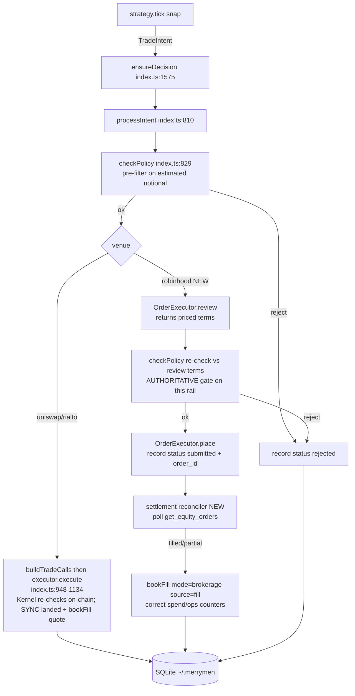

# Robinhood Agentic-Trading MCP Adapter — Design Doc

## 1. TL;DR

Yes, build it — but as a **second venue with a fundamentally different trust model**, gated behind a flag, paper-first. (Originally "self-hosted only"; revised — hosted token custody is now permitted under the §3 conditions, because the token maps to the session key, not the owner key.) The equities brain you already have (decisions → checkPolicy → paper/breaker → Telegram/dashboard) is largely venue-agnostic and rides for free; the model boundary (`ProposedAction{action,symbol,sizeUsdg}`, `worker/src/strategist/proposals.ts:15`) already maps 1:1 onto `place_equity_order`. The exception is the deterministic strategies — most do **not** port (§6 roster) — but the LLM strategist and a plain rebalancer do. The single biggest catch, and it dwarfs every plumbing question: **on this venue there is no on-chain wall behind `checkPolicy`.** `worker/src/policy.ts:1-10` states in its own header that it only *mirrors* an authoritative on-chain rule and "the on-chain policy wins" on any disagreement. Robinhood's Agentic account is custodial, exposes a single `internal` OAuth scope with no read-only grant (`spikes/robinhood-mcp/README.md:31,61-65`), and the held bearer token can place trades with nothing capping it below full trading. So `policy.ts` inverts from cheap pre-filter to **sole client-side enforcement**, and every on-chain guarantee (per-call cap, spender allowlist, cryptographic key-death, rate limit) loses its backstop at once. That inversion — not the type mismatches — is the whole risk surface.

## 2. Context

**What Robinhood shipped.** A hosted MCP server at `https://agent.robinhood.com/mcp/trading` that lets an AI agent trade a dedicated, **custodial** brokerage "Agentic account." Streamable HTTP transport; OAuth 2.1 + PKCE(S256), RFC 9728 challenge (`spikes/robinhood-mcp/explore.mjs:139-196`).

**What the spike established** (`spikes/robinhood-mcp/README.md`, `explore.mjs`):

| Fact | Evidence | Consequence |
|---|---|---|
| Transport = streamable HTTP (GET→405, POST only) | README recon table | Reuse the hand-rolled JSON/one-shot-SSE client (`explore.mjs:213-247`); a naive `res.json()` breaks on the SSE framing |
| OAuth 2.1 / PKCE S256; authorize at `robinhood.com/oauth`, token at `api.robinhood.com/oauth2/token/` | `explore.mjs:79-83,157-189` | Reuse `discover()`/`authorize()` verbatim |
| "Registration" is a no-op — same shared `client_id` `LtLiNmbs9owbYfWgBlC68Z2VujIPuvGoAiSYr8xW`, name "Robinhood Trading", regardless of inputs | README:34-42; `explore.mjs:85-100` sends `client_name:"merrymen"` and gets the shared id back | `client_id` carries **zero agent identity**; the consent screen cannot say it's merrymen |
| Single scope `internal`, **no read-only grant** | README:31,61-65 | Any authorized client can place orders; "monitor only" is a code promise, not a capability floor |
| No `client_secret` — public client, `token_endpoint_auth_method:"none"` | README:29-31 | Nothing authenticates the client beyond PKCE; a hosted multi-tenant variant can't even prove which deployment redeemed a code |
| Loopback (`127.0.0.1:8765`) redirect works **UNVERIFIED** | README:44-49; `explore.mjs:109` | Blocked at authorize-time behind an account gate; the entire `waitForCode` design rests on this assumption |
| Live `tools/list` **UNREAD** — blocked at the Agentic-account setup gate | README:51-57 | Documented tools (below) are from docs, not the wire |
| Token exchange never completed on the wire | README:51-57 (blocked at the gate) | Whether a **refresh** token is issued, and its lifetime, is UNVERIFIED (§11 Q7) — treat "refresh token" as conditional throughout |

**Documented-but-unconfirmed tool surface:** `get_accounts`, `get_portfolio`, `get_equity_positions`, `get_equity_quotes`, `get_equity_orders`, `search`, and the pair `review_equity_order → place_equity_order`. Equities only in beta; options/crypto/futures "coming soon."

**Still unknown / blocked:** loopback-at-authorize, real input schemas, order-state vocabulary, budget-enforcement mechanics (per-order vs rolling window; whether `review_equity_order` returns a signed/idempotent order token `place` must echo; whether `review` returns remaining budget), and whether the consent screen names the agent at all (README:70). Note task **#83 "Design the hosted (multi-tenant) worker service on Railway" is still pending** — this doc originally argued that path must not hold brokerage tokens; **that is revised in §3**, and #83's design must now include this venue under §3's conditions (KMS-wrapped per-tenant tokens, budget-gate verification first, approval-mode default).

## 3. Goals / Non-goals

**Goals**
- Add Robinhood equities as a **second venue** that the existing brain can drive without forking decisions/paper/breaker/Telegram/dashboard.
- Paper-first: run the full loop today against `get_equity_quotes` while the live account gate blocks trading.
- Preserve "LLM proposes, deterministic code disposes" — the `review_equity_order → place_equity_order` pair *is* that boundary.

**Non-goals (explicit)**
- **This is NOT an extension of the non-custodial guarantee.** The on-chain rail's promise — "the limits live in the account contract on-chain, not in this app" — is **false** on this venue. Do not let marketing conflate them (§9).
- ~~Never a hosted service that holds brokerage tokens. Self-hosted only.~~ **REVISED 2026-08-01 — hosted token custody is permitted, under the conditions below.** The original non-goal is kept struck-through rather than deleted because the *reason* it was wrong is the useful part: it mapped the OAuth token to the **owner private key**, and that is the wrong analog. The correct mapping is to the **session key** — the thing the standing invariant already permits a hosted service to hold ("only the serialized, capped, expiring session account"). The token is **delegated, bounded, revocable authority**, not root: bounded by Robinhood's server-side reserved budget on an Agentic account funded only with what the owner chose to expose; revocable instantly by the owner at Robinhood, out-of-band from us; supervised by the custodian itself, which pushes trade notifications to the owner's own Robinhood app; and *designed* to be held by hosted third-party agents — that is the venue's stated product, and ChatGPT/Claude integrations already hold it server-side. The owner-key analog on this venue is the **Robinhood login + 2FA, which OAuth guarantees never touch merrymen**, hosted or not. It is a *weaker* session key than the on-chain one — caps are Robinhood's account budget rather than cryptographic policy, and no read-only scope exists — but it is the same class.

  **Conditions, all binding.** (1) **Robinhood's reserved-budget enforcement must be verified on a live account (§11 Q4) before the first hosted token exists** — it is the only floor under a hosted breach, and if it turns out advisory this revision reverses. (2) Per-tenant encrypted token storage (KMS-wrapped) on the hosted worker; tokens registered for redaction **by value**; an in-app "disconnect at Robinhood" deep link; revocation on account deletion. (3) Site copy states it plainly, per-venue: on this rail merrymen holds a revocable, budget-capped trading token and Robinhood is the custodian — no "non-custodial" language anywhere near it (§9). (4) **No performance fee on the brokerage rail** until counsel has reviewed the investment-adviser question — hosted discretionary trading of others' brokerage accounts for a share of profits is adviser-shaped in a way self-hosted software is not; flat subscription is the safe shape. (5) Onboarding defaults to **approval mode** (each order confirmed from a push notification); full autonomy is an explicit toggle. What remains absolute and unrevised: **owner private keys and Robinhood login credentials are never held by any hosted service.**

  Why the phone forced the question: an autonomous equities agent cannot live on the phone at all — iOS will not run a suspended app's trading loop during market hours, so "token on the phone, phone trades" is not a weaker option, it is not an option. The choice was hosted custody or no autonomous product on this venue.
- No "read-only mode" claimed as a *technical* guarantee — the single `internal` scope can place orders, so monitor mode is disclosed as a client-side promise.
- Do **not** refactor the audited on-chain execution hot path to accommodate this venue (see §4, Option-3 rejection).

## 4. Architecture — the venue abstraction

**Principle: shared control plane, forked data plane.** Keep the one `processIntent` spine (`worker/src/index.ts:810`) and its `checkPolicy` choke point (`index.ts:829`) — every chat and tick trade already funnels through it (`index.ts:1541`, `1572-1580`), so decisions journaling, `/why` attribution, Telegram digests and the dashboard are inherited. Do **not** force custodial execution/valuation through the EVM-shaped types.

**The smallest interface that works.** There is **no `Venue`/`VenueAdapter` abstraction anywhere today** — the venue choice is a hard-wired `if/else` on `cfg.swapVenue` (`index.ts:948-1134`). A full `Venue{quote,value,execute,reconcile}` interface (refactoring both rails behind it) is the clean long-run shape but is **rejected for v1**: it rewrites `executor.ts` — the exact code the security model rests on — to hang an un-audited venue on it, and it can't be typed against the wire because `tools/list` is unread. Instead, introduce **three new, additive seams** (none exists today):

1. **`OrderExecutor`** — a sibling to `AgentExecutor` (`worker/src/executor.ts:26-31`), *not* a widening of it. `AgentExecutor.execute(Call[]) → 0x txhash` is EVM-shaped (`executor.ts:20-31,61-72`) and a custodial order has no `to/value/data` and no tx hash. **Must be created:**
   ```ts
   // worker/src/executor-order.ts  (NEW FILE)
   export interface OrderRef { orderId: string; status: OrderStatus; }
   export interface OrderExecutor {
     review(o: EquityOrder): Promise<ReviewResult>;   // review_equity_order (dry run, priced terms)
     place(o: EquityOrder, review: ReviewResult): Promise<OrderRef>; // place_equity_order
     poll(ref: OrderRef): Promise<OrderRef>;           // get_equity_orders
   }
   ```
   A `createRobinhoodExecutor({ token })` factory (parallel to `createAgentExecutor`, `executor.ts:33`) holds the MCP client + OAuth access token — **never a private key**.

   **Wiring decision — `ActiveAgent` must gain a field.** Because `OrderExecutor` is a sibling type, not a subtype, `ActiveAgent.executor` (typed `AgentExecutor | null`, `index.ts:179`; destructured at `index.ts:816`) cannot hold it. Add a separate `orderExecutor: OrderExecutor | null` to `ActiveAgent`. The existing paper/live fork `if (!executor)` (`index.ts:846`) and `paperActive() = !!active && !active.executor` — "a grant but no signer" (`index.ts:207`) — have **no broker analog** (a broker account has neither grant nor signer), so broker paper-vs-live is a **distinct venue-scoped `simulate` flag** (with `review_equity_order` as the dry run), *not* keyed on executor presence.

2. **`TradeIntent` `kind:"equity-order"` variant** — the union at `policy.ts:45-78` is ERC-20-addresses-and-raw-units. **Must be created:** `{ kind:"equity-order"; ticker:string; side:"buy"|"sell"; notionalUsdg?:bigint; qty?:number }`. The `swap`/`vault-*`/`transfer` variants are **dropped** on this venue (vault sweep and chat `/transfer` have no custodial analog).

3. **`PriceQuote.source` `"broker"` member** — the required union is `"chainlink"|"pool"` (`packages/core/src/tokens.ts:74-82`), deliberately non-defaulting so a forgotten field can't read as trustworthy. **Must be added** and threaded through every switch, critically the valuation multiplier switch at `positions.ts:220`.

`readMarketSafety()` (`worker/src/snapshot.ts:59`) already returns `Map<symbol, PriceQuote>`; a broker arm just fills it from `get_equity_quotes` — no new price interface needed.

**Strategy roster on the broker venue.** Do NOT claim the strategy layer "rides for free." Registered when `venue=robinhood`: the **LLM strategist** (`ProposedAction` maps 1:1) and an **equities rebalancer** (even-keel re-spec'd to drop 18dp-share math). Not registered / dropped: **weekend-gap** (thesis is a tokenized wrapper decoupled from a closed underlying via Chainlink staleness — dead on the underlying), **trencher** (consumes chain-only pool depth/FDV signals), **steady-basket's vault legs** (no custodial vault), **dip-hunter as-is** (carries 18dp math; re-spec optional). Crucially, **do not overload `Snapshot.staleFeeds`/`sequencerUp` with a new "market-session" meaning in place** — weekend-gap keys its state machine on `staleFeeds` with on-chain semantics (feed >2h old, `snapshot.ts:94`), so a per-venue meaning change would silently corrupt any shared strategy that reads it. Instead the broker roster excludes strategies that read those fields, and market-session state (RTH / extended / closed) is surfaced as a **distinct signal** the equities strategies consult.

**Flow (both rails, shared spine bolded):**



The Snapshot builder (`index.ts:1526-1539`), valuation (`positions.ts:137`), and equity sum (`index.ts:1373`) each grow a broker arm; the `Strategy` contract (`worker/src/strategies/types.ts:55-58`, `tick` already async, Snapshot already symbol-keyed) is unchanged.

## 5. The trust model (read this twice)

This is the section that decides whether the thing is safe. The on-chain rail's guarantee is that **the wall IS the account contract**: the session key is wrapped in a permission validator "enforced BY THE ACCOUNT CONTRACT on every UserOp" (`web/src/lib/session.ts:14`), and this code "cannot exceed them even if buggy" because Kernel/EntryPoint 0.7 re-checks on-chain (`worker/src/executor.ts:3-4`). None of that exists here.

| Guarantee | On-chain rail | Robinhood rail |
|---|---|---|
| Per-call amount cap | Kernel CallPolicy re-check | **Off-chain only** — `policy.ts` per-op cap, no backstop |
| Spender/target allowlist | `ONE_OF` 4 addresses on-chain | **Off-chain ticker allowlist only** |
| Expiry | Cryptographic key-death (nonce dead after `validUntil`) | Numeric compare (`policy.ts:136`); OAuth token has its own lifetime, **cannot force-expire** like a session key |
| Rate limit | On-chain rate-limit policy | Off-chain in-process counter |
| Daily USD cap / drawdown / scout | Already off-chain, no on-chain twin | **Ports unchanged** (the only clean part) |
| Auth secret | Session key in serialized grant (already on the box) | **OAuth access token (+ refresh if issued)** — moves money, no scope limit |

**What must be added to `policy.ts` to make it authoritative** (it is written as a mirror, `policy.ts:1-10`, and "never stricter than the chain," which assumes a chain):

1. **Retype `AgentLimits`** (`policy.ts:14-43`) from `0x allowedTargets/allowedAssets` + 6dp-USDG to a **ticker allowlist + USD notional**. Drop `sellableAssets`/the no-exit rule (`policy.ts:165-176`) — meaningless when the broker always lets you sell.
2. **Keep and now *rely on*** the daily cap, ops cap, and drawdown breaker (`policy.ts:212-252`). The breaker already has no on-chain twin (`session.ts:26`), so it ports unchanged if fed equity from `get_portfolio`.
3. **Flip the posture from "never stricter than the chain" to deliberately conservative.** There is nothing behind it.
4. **Relocate the counters — but be honest about the ceiling.** `AgentState.spentTodayUsdg`/`opsToday` are caller-supplied in-process variables each tick (`policy.ts:84-87`), seeded from SQLite on restart (`store.ts:478/510`). They must move to **persistent** state so they survive restart and can be corrected at settlement (§6). **What persistence does NOT buy is tamper-resistance against a compromised or buggy worker:** on a self-hosted worker the *same process* both runs `checkPolicy` and writes the SQLite counters, so no client-side store is a floor beneath that process — a worker that skips or mis-computes `checkPolicy` overspends regardless of where the counters live. The only enforcement *below* the worker is **Robinhood's server-side reserved budget**, whose mechanics are UNKNOWN (§11 Q4). This design therefore depends on that reserved budget being a real per-account cap; sell the persistent counters as **durability and correct accounting, not a security floor**.

**Token custody + redaction.** Store the OAuth token(s) in `~/.merrymen`, next to the grant that *already* custodies funds there (`worker/src/telegram/service.ts:232`). Register in `cfg.secrets` so `redactSecrets` strips them from every Telegram/log/tool output (`service.ts:233-248`, `agent.ts:129-136`). **Redaction gap:** an opaque (non-JWT) bearer won't match `SECRET_SHAPES`'s `eyJ`-JWT pattern (`agent.ts:119-126`) and will leak — it must be added **by value**, exactly as the base64 `grant.serialized` blob was (`service.ts:242-244`).

**The `review → place` guard, and where the deterministic wall actually runs.** `checkPolicy` at `index.ts:829` runs **before** the venue branch, on the intent's *estimated* notional. On the on-chain rail that is fine because the Kernel contract re-checks the *actual* amounts; here there is no re-check. So on the broker rail **`checkPolicy` runs twice**:

- **(a)** a cheap pre-filter at `index.ts:829` on the estimated notional; then
- **(b)** an **authoritative re-check against the priced terms `review_equity_order` returns** (est. fill price, notional, fees), immediately before `place_equity_order`.

`place` fires only if the reviewed terms fall inside the caps — a slippage or market move that pushes `review` above the cap is caught by (b) and never reaches `place`. This is the `review → place` propose/dispose pair. Invert the spike's deny-by-default (`explore.mjs:60-62`: `DENY_EXACT={place_equity_order}` + verb-prefix regex): production **allow-lists exactly the `review_equity_order → place_equity_order` pair**; every other tool, and every future `place_*/cancel_*` when options/crypto/futures ship, stays refused by the same regex. Route every model-proposed call through the one `Mcp#call` chokepoint (`explore.mjs:258`). `review` is the dry-run/affordability analog that replaces the on-chain QuoterV2 + `selfTestIntent` probe (`index.ts:163-172`).

## 6. Execution & valuation

**Order lifecycle — "landed" ≠ "filled."** The on-chain path calls `executor.execute()`, gets a tx hash **synchronously**, and immediately writes `status:"landed"` + `bookFill(...,"quote")` at submit time (`index.ts:1146-1152`, esp. `1148`,`1149`). `place_equity_order` returns **"accepted," not "filled"**; it fills async/partial/late during market hours. So on this rail:

- Submit records `status:"submitted"` with the `order_id` — **must not run `bookFill` or write `landed`.**
- A **settlement reconciler must be created** (poll `get_equity_orders`, modeled on the live-basis reconcile pass at `index.ts:1375-1390`) that flips the row to filled/partial/cancelled, books basis from the **actual** fill with a new `basis_source:'fill'` (distinct from `'quote'`/`'paper'` so estimates never mix), and **corrects the spend/ops counters** — because async fills never re-enter the synchronous reserve/rollback try/catch (`index.ts:936-937`, `1155-1156`), which only unwinds on a synchronous throw.

**Market hours.** Outside RTH `review_equity_order` will reject/queue. Surface market-session state (RTH/extended/closed) to the equities strategies as its **own** signal — do **not** repurpose the Snapshot's `staleFeeds`/`sequencerUp` (`types.ts:37-38`), whose on-chain meaning (Chainlink feed >2h old, expected on weekends, `snapshot.ts:94`) is a different concept the `stale:boolean` flag can't express and which shared strategies read literally (§4).

**Quotes in USD, shares vs tokens — one unit decision, stated once.** Valuation is `rawBalance × uiMultiplier × price8 / 10^(decimals+20)` → USDG 6dp (`positions.ts:50-60`), with the split-hazard switch `valuationMultiplier = source==="pool" ? 1e18 : uiMultiplier` (`positions.ts:220`). The valuation formula is **not** unit-agnostic on the share side — it hard-codes the multiplier and `10^decimals`. Resolve it by **defining the brokerage share unit once and pinning it:**

- Carry fractional shares as an **integer at a fixed precision** (e.g. `shares × 1e8`), with the ERC-8056 multiplier **forced to `1e18`** for `source:"broker"` (broker share counts are already split-adjusted; applying `uiMultiplier` double-counts a split, ratchets a phantom HWM, and trips the breaker on nothing — the exact failure the `positions.ts:213-219` comment warns about).
- With that marshaling, **`positionValueUsdg` is reused unchanged**: set `decimals` to the chosen share precision, `price8 = USD × 1e8`, multiplier `1e18`, and `rawBalance × 1e18 × price8 / 10^(decimals+20)` yields USD at 6dp exactly.
- What is **genuinely scale-agnostic** and reused with only a label change is the money-side math: `accrueAboveHwm` (`fees.ts:26`) and `applyFill` (`basis.ts:74`).
- What must **NOT** be reused blindly is the **cost-basis scale**: `cost_basis.qty_raw` is 18dp and the paper path does `BigInt(Math.round(shares*1e18))` (`index.ts:901`). The `'brokerage'` `BasisMode` must use the **same chosen share precision**, and — because a broker split **changes** the reported share count (breaking the on-chain split-invariance premise, `basis.ts`) — brokerage basis must be **reconciled from `get_equity_positions` on corporate actions**, not assumed invariant.

Feed `get_equity_quotes` into a broker arm of `readMarketSafety`; feed `get_equity_positions`/`get_portfolio` into broker arms of `readPositions` (`positions.ts:137`) and `readAccountBalances` (`snapshot.ts:116`). Equity becomes a **passthrough of `get_portfolio`**, not the `cash+vault+positions+quarantine` sum (`index.ts:1373`) — vault/ETH terms are chain-only. Keep **buying power distinct from settled cash** for affordability checks (`proposals.ts:88` gates buys on `snap.cashUsdg`; margin buying power must not be treated as settled cash).

**Paper-first — mandatory default.** `applyPaperIntent` (`worker/src/paper.ts:84-197`) already transfers cleanly: fills at the live quote, models USDG-paired legs, and refuses rather than invents a fill when there's no price. Given the account gate and unread `tools/list`, paper is the **only** way to run the full loop today. Live equities execution sits behind an explicit real-money flag that **cannot arm** until a funded Agentic account exists and `tools/list` has been read. Note there is **no safe live pipeline probe** — the `selfTestIntent` USDG→USDG no-op (`index.ts:163-172`) has no brokerage equivalent (every `place_equity_order` is a real order), so the probe must be a **read-only `get_accounts` call**.

## 7. Data model changes (`worker/src/store.ts`)

The `trades` table's only external references are `user_op_hash`/`tx_hash`, both on-chain-only (`store.ts:42-55`). Additive, not a rewrite:

| Change | Where | Why |
|---|---|---|
| **Decide the broker `agent_id`** | new: `rh:<account_number>` from `get_accounts`, namespaced so it can't collide with a `0x` smart-account id | `agent_id === the ERC-4337 smart_account address` today (`store.ts:23`) and threads every per-agent table — agents/trades/decisions/positions/cost_basis/equity/fee_accruals, including HWM/fees keyed at `store.ts:304`; a custodial account has an account number, not an address. Every per-agent row inherits this key |
| Add `order_id TEXT`, `settlement_status TEXT` | `trades` DDL `store.ts:42-55`; `addTrade` `store.ts:368` grows two params | A brokerage order has an `order_id` and no tx hash; `status` is a synchronous 4-enum `landed\|reverted\|rejected\|paper` (`store.ts` / `index.ts:1148`) that can't express queued→accepted→partial→filled→settled |
| Add third `BasisMode 'brokerage'` | `store.ts:601` + status map `store.ts:657-658` | Folding broker fills into `'live'` lets a custodial fill price an on-chain position's sell — the exact hazard the `cost_basis` DDL comment (`store.ts:133-138`) warns about; and `getRealizedPnlUsdg` hard-maps `mode→status`, so without a mapping broker P&L reads **zero everywhere** |
| Teach 24h window/status predicates the new terminal states | `getOpsToday`/`getSpentTodayUsdg`/`getTransferredTodayUsdg` `store.ts:478-519` | They filter `status IN ('landed','paper')`; add `filled/settled/partial` or every budget under-counts and the agent overshoots |
| Add `basis_source:'fill'` | `bookFill` `index.ts:738-779` | Book the settled fill, never mix it with the pre-trade `'quote'` estimate |
| ~~Fix `created_at`~~ — **CORRECTED, see note below** | — | The original claim here was **wrong**. `addTrade`'s INSERT names 20 columns and `created_at` is not among them (`store.ts:372-375`), so the ISO string every caller passed was silently discarded and the DDL default `unixepoch()` always supplied a correct INTEGER. The 24h windows have always worked. What *was* real — a required `TradeRow.created_at: string` that 14 sites filled and nothing read — is fixed; a reconciler needing a real fill time must add its own `filled_at` column |

**Unit hazard, restated for the store:** `cost_basis.qty_raw` is 18dp raw units and the paper path does `BigInt(Math.round(shares*1e18))` (`index.ts:901`). The `'brokerage'` mode must use the single chosen share precision from §6 (not the on-chain 18dp assumption) and reconcile share counts on corporate actions — feeding broker shares through the existing 18dp path is a 10^18 error waiting to happen.

## 8. Onboarding & operator UX

**vs the mnemonic path.** The on-chain path generates owner+session keypairs and seals wall policies into a Kernel account (`web/src/lib/session.ts:147-166`). The Robinhood path has **no keypair, no grant, no signing** — onboarding is an OAuth dance:

1. Owner runs `merrymen onboard --venue robinhood`. Worker runs the spike's flow: `discover()` (`explore.mjs:79`) → skip/hardcode the no-op `register()` (`explore.mjs:85`) → build authorize URL (`explore.mjs:157-168`) → open browser.
2. Owner logs into Robinhood, consents (⚠ the screen may not name merrymen — §11), and is redirected to the loopback catcher `127.0.0.1:8765/callback` (`explore.mjs:109-131`, state-checked).
3. Worker exchanges the code for the token(s) (`explore.mjs:179-189`), persists to `~/.merrymen`, registers in `cfg.secrets` **by value** (§5).

**Venue selection.** Widen `swapVenue: "uniswap"|"rialto"` (`worker/src/settings.ts:42`) and its `oneOf` whitelist (`settings.ts:233`) to include `"robinhood"`; `cfg.swapVenue` selects the branch. Consider renaming to `venue` since "swap" is now a misnomer, but that's a mechanical follow-up.

**Deployment-shape caveat.** The loopback catcher assumes the browser can reach `127.0.0.1` on the same host as the worker — fine for a self-hosted desktop worker, impossible for a hosted one. The hosted worker uses the opposite shape, and it is the *stronger* one: the redirect URI is a normal `https://` endpoint on the backend; the phone opens the consent URL, Robinhood redirects to the backend, and the token never transits the phone at all. This also **sidesteps the one flow step the spike never verified** — whether the shared client accepts a `127.0.0.1` redirect (§11 Q1) — because an https URI is the shape every existing hosted integration already uses. The loopback path remains for the desktop CLI, and remains unverified until someone runs it against a live account.

**Kill switch.** Reuse the existing pause marker end-to-end; add an out-of-band note that killing access on this venue means **revoking the OAuth grant at Robinhood** — there is no nonce-invalidation "revocation = expiry" equivalent (`session.ts:20`).

## 9. Site/marketing copy that must change (per-venue)

`README.md:82-84` marks this a **prerequisite, not a follow-up.** These claims are **true for the on-chain rail and false for the Robinhood rail** and must be split per-venue. Each row cites the line that actually carries *that* claim:

| Claim | Where it appears | False on the broker rail because |
|---|---|---|
| literal "non-custodial" / "self-custody" | `site/app/layout.tsx:28` (keywords), `:32` (og description) | Robinhood is the custodian |
| "keys stay on your machine" / "recovery phrase never leaves this phone" | `package.json:4`; `site/app/page.tsx:96`; mobile `grant.tsx:151` | There is no key on this venue — there is a bearer OAuth token |
| "caps enforced by the account contract on-chain" | `package.json:4`; `site/app/page.tsx:192`; `site/app/layout.tsx:27`; `site/components/Footer.tsx:28`; mobile `grant.tsx:106` | Caps are client-side only; no contract enforces them |
| "We never take custody of your keys, funds, or accounts" | `site/app/terms/page.tsx:52` | Must carve out: on this venue Robinhood is custodian and merrymen holds a trading token |

(`package.json:4` is one description line that makes both the keys and the caps claims, hence its appearance in two rows.) Also disclose that **monitor mode is a code promise, not a technical read-only grant** (single `internal` scope).

## 10. Phased build plan

Each step ships value independently; ordered by dependency. **★ = blocked on the funded Agentic account gate.**

| # | Step | Value | Blocked? |
|---|---|---|---|
| 0 | ~~Fix `created_at`~~ → **DONE, and smaller than billed.** Removed the discarded `TradeRow.created_at` field and its 14 assignments | Deletes a type that promised control the code didn't have. **No data was ever wrong** — see §7 | No |
| 1 | **Lift the MCP client + OAuth flow** into `worker/` (from `explore.mjs`): `discover/authorize/loopback/token`, JSON+SSE framing, session-id capture, token→`cfg.secrets` by value | Owner can authenticate; read-only probe works | No |
| 2 | **Broker `PriceSource` + read-only Snapshot**: `"broker"` in `PriceQuote.source`, broker arms of `readMarketSafety`/`readPositions`/`readAccountBalances`, force multiplier=1e18 | Live portfolio + tape on the dashboard, zero trade risk | Partial (quotes need auth) |
| 3 | **`equity-order` intent + equities `proposalsToIntents`** (drop 18dp-share math `proposals.ts:110-114`, ticker allowlist) + **paper `OrderExecutor`** + broker `simulate` flag + `orderExecutor` field on `ActiveAgent` | Full agentic loop in **paper** — strategist, breaker, Telegram, `/why` all work | No |
| 4 | **`policy.ts` promotion**: retype `AgentLimits` to tickers+USD, drop no-exit, make counters persistent, conservative posture; broker `agent_id` scheme | The client-side wall is real before any live order is possible | No |
| 5 | **Store columns** `order_id`/`settlement_status` + `'brokerage'` BasisMode + status-predicate updates | Broker fills are attributable and P&L-visible | No |
| 6 | **Live `OrderExecutor`** (`review → place` allow-list, **two-stage `checkPolicy`**) + **settlement reconciler** + real-money flag | Live equities trading | **★** |
| 7 | **Site copy split** per-venue | Honest launch | No (but gates launch) |

Steps 0–5 and 7 are fully unblocked and deliver a paper-trading equities agent plus a live read-only portfolio view. Only step 6 waits on the account gate.

### Test coverage (ships with the relevant step)

The equities `checkPolicy` becomes the **only** enforcement on a real-money custodial venue, so it needs the same pinning discipline the on-chain wall gets from `policy.test.ts`/`wall.test.ts`:

- **Equities `checkPolicy` (step 4)** — per-trade USD cap, rolling daily cap, ops cap, ticker allowlist accept/reject, drawdown breaker on `get_portfolio` equity, and the **two-stage** behavior: a `review` result whose priced terms exceed the cap is rejected at stage (b) even though the estimate passed at stage (a). Mirror `policy.test.ts`.
- **Streamable-HTTP parser (step 1)** — both legal framings: a JSON body and a one-shot SSE stream whose `data:` lines are stripped and concatenated; `Mcp-Session-Id` captured off any response; protocol version pinned `2025-06-18`.
- **Settlement reconciler (step 6)** — counter correction on a **partial** fill and on a broker-side **rejection/cancel** after `submitted`, proving spend/ops accounting converges to the actual fill and never to the estimate.
- **Redaction (step 1)** — an **opaque, non-JWT** Robinhood token is stripped from Telegram/log output because it was added to `cfg.secrets` **by value** (it does not match the `eyJ` `SECRET_SHAPES` pattern, `agent.ts:119-126`).

## 11. Open questions — verify against a live account first

Everything the spike left open, plus what this design assumes:

1. **Loopback-at-authorize** (README:44-49). `register()` echoing `redirect_uri` proves nothing (it ignores inputs); `127.0.0.1` may be rejected against the shared client's real registered URIs, validated *past* where the unauthenticated spike reached. The entire `waitForCode` design (`explore.mjs:109`) depends on this.
2. **Live `tools/list` + real input schemas** (README:51-57). The adapter is currently typed against *docs*, not the wire. Re-run the exact command against a funded account before freezing `OrderExecutor`/`EquityOrder`/`settlement_status`.
3. **`review_equity_order` idempotency** — does it return an opaque/signed order token that `place` must echo? The two-stage safety design (checkPolicy-against-review, then place) depends on the answer.
4. **Budget-enforcement mechanics** (README:52-57) — per-order vs rolling window; does `review` return remaining budget? This is load-bearing: per §5 it is the *only* cap floor beneath a compromised worker, so the design cannot lean on it until its shape is known.
5. **Order-state vocabulary** — the exact set of terminal/interim states `get_equity_orders` reports (for `settlement_status` + the counter predicates).
6. **Does the consent screen name the agent?** (README:70) The shared `client_id` carries no identity — if it doesn't, that's a phishing surface the owner must be warned about.
7. **Is a refresh token issued, and what is its lifetime?** Never seen on the wire. It's not tied to `GrantCaps.expiryDays` and can't be force-expired by us — though the owner can revoke at Robinhood at any time, which is the revocation path §3's revision leans on.
8. **Extended-hours semantics** — what `review_equity_order` does outside RTH (reject vs queue), to calibrate the distinct market-session signal.

## 12. Risks & recommendation

**Top risks**

- **`checkPolicy` is the only client-side wall, and its counters live where the worker itself can bypass them** (`policy.ts:84-87`; reserve/rollback `index.ts:936-937`,`1155-1156`). Persistence buys durability, not tamper-resistance; the sole floor below the worker is Robinhood's reserved budget, whose mechanics are unknown (§11 Q4).
- **Async settlement breaks reserve/rollback** — a late partial/reject never re-enters the sync try/catch; without the reconciler, budgets silently drift.
- **Held bearer token = delegated money-moving secret.** Session-key class, not owner-key class (§3 revision) — hosted custody permitted, but only behind §3's conditions, and the whole posture rests on Robinhood's reserved budget being real enforcement (§11 Q4). Verify that before the first hosted token, or this risk reverts to critical.
- **Valuation double-count** if a broker quote is mislabeled at `positions.ts:220` → phantom HWM + false breaker trip.
- **Design-against-docs** — `tools/list` unread; any frozen interface must be revalidated on a funded account.
- **No read-only scope** — "monitor only" is unenforceable, only promised.

**Recommendation: build now, behind a flag, paper-first. Hosted custody per §3's conditions; approval mode as the default posture.**

Ship steps 0–5 and 7 immediately — they're unblocked and they deliver a paper equities agent plus a live read-only portfolio with near-zero risk. (Step 0 is done, and turned out to be a dead type field rather than the data-corruption bug this doc originally claimed — the correction is recorded in §7 and §10 rather than quietly edited out, because the way it was "empirically confirmed" is instructive: the check exercised a hypothetical INSERT that wrote a TEXT timestamp, not the INSERT `addTrade` actually issues. A verification that doesn't run the real code path proves nothing about it.) **Gate live execution (step 6) behind both the funded-account gate and an explicit real-money flag that cannot arm until `tools/list` is read on the wire.** The hosted/multi-tenant variant is in scope per §3's revision — task #83's design carries this venue under §3's binding conditions. Reject the full `Venue` refactor for v1 (never rewrite the audited on-chain wall to add an un-audited custodial venue, and it can't be typed against the wire yet). The architecture that survives all of this is the shared control plane + honest sibling data plane in §4: one `processIntent`/`checkPolicy` spine (with a second, authoritative `checkPolicy` against `review`'s terms on the broker rail), a new `OrderExecutor` and `equity-order` intent that never touch `Call`/`txhash`/18dp-raw, and a `policy.ts` that stops pretending it's a mirror — while being candid that on a self-hosted custodial venue, the last line of defense below the worker is Robinhood's own reserved budget, not our code.
